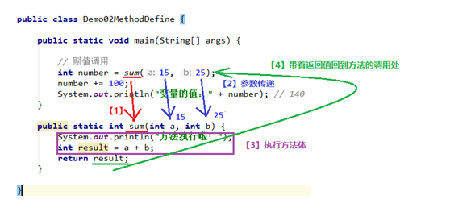

# 

# JavaEE

## Java基础语法(第1级)

### Demo01_前言、入门程序、常量、变量


#### 1.1计算机存储单元

位（bit）：0或1代表一位

字节（Byte）：每逢8位是一个字节，是数据存储的最小单位

1Byte=8bit，1Kb=1024Byte，1Mb=1024Kb,1Gb=1024Mb…

#### 1.2Cmd操作

| 切换盘符       | 盘符名称：                 |
| -------------- | -------------------------- |
| 进入文件夹     | cd 文件夹名称              |
| 进入多级文件夹 | cd 文件夹1\文件夹2\文件夹3 |
| 返回上一级     | cd ..                      |
| 返回根目录     | cd \                       |
| 查看当前内容   | dir                        |
| 清屏           | dls                        |
| 退出           | exit                       |

#### 1.3注释

单行注释：//   

多行注释（区块）/* */

#### 1.4配置环境变量

高级系统设置>高级>环境变量>系统环境变量内新建>

1.变量名为JAVA_HOME 变量值为java路径

2.找到path目录添加java路径

#### 1.5关键字特点

1.完全小写的字母

2.在增强版记事本中（如notepad++）有特殊颜色

#### 1.6标识符

- 命名规则： 硬性要求

1.标识符可以包含英文字母26个(区分大小写) 、0-9数字 、$（美元符号） 和_（下划线） 

2.标识符不能以数字开头

3.标识符不能是关键字

- 命名规范： 软性建议

1.类名规范首字母大写，后面每个单词首字母大写  大驼峰式。

2.方法名规范首字母小写，后面每个单词首字母大写 小驼峰式。

3.变量名规范：全部小写。

#### 1.7常量

是指在Java程序中固定不变的数据。

| 类型       | 含义                                   | 数据举例                |
| ---------- | -------------------------------------- | ----------------------- |
| 整数常量   | 所有的整数                             | 0，1， 567， -9         |
| 小数常量   | 所有的小数                             | 0.0， -0.1， 2.55       |
| 字符常量   | 单引号引起来,只能写一个字符,必须有内容 | 'a' ， ' '， '好'       |
| 字符串常量 | 双引号引起来,可以写多个字符,也可以不写 | "A" ，"Hello"  ，"你好" |
| 布尔常量   | 只有两个值（流程控制中讲解）           | true ， false           |
| 空常量     | 只有一个值（引用数据类型中讲解）       | null                    |

#### 1.8数据类型

| 数据类型     | 关键字         | 内存占用 | 取值范围               |
| ------------ | -------------- | -------- | ---------------------- |
| 字节型       | byte           | 1个字节  | -128~127               |
| 短整型       | short          | 2个字节  | -32768~32767           |
| 整型         | int（默认）    | 4个字节  | -231次方~2的31次方-1   |
| 长整型       | long           | 8个字节  | -2的63次方~2的63次方-1 |
| 单精度浮点数 | float           | 4个字节  | 1.4013E-45~3.4028E+38  |
| 双精度浮点数 | double（默认） | 8个字节  | 4.9E-324~1.7977E+308   |
| 字符型       | char           | 2个字节  | 0-65535                |
| 布尔类型     | boolean        | 1个字节  | true，false            |

### **Dem02_****数据类型转换、运算符、方法入门**


#### 2.1自动类型转换

1.特点：代买不需要进行特殊出来，自动完成

 2.规则：数据范围从小到大

#### 2.2强制类型转换

1.特点：代码需要进行特殊的格式处理，不能自动完成

2.格式：范围小的类型 范围小的变量名 = (范围小的类型) 原本范围大的数据

**注意事项：**

1.强制类型转换一般不推荐使用，因为有可能发生精度损失、数据溢出。

2.byte/short/char这三种类型都可以发生数学运算，例如加法“+”

```java
char zifu1=’A’;
System.out.println(zifu1+1);  //66
```

3.byte/short/char这三种类型在运算的时候，都会被首先提升成为int类型，然后再计算。

```java
byte num1=40;
byte num2=50;
//byte+byte》》int+int=int
Int result=num1+num2;   //90
```

4.boolean类型不能发生数据类型转换

#### 2.3ASCII编码表

| 字符 | 数值 |
| ---- | ---- |
| 0    | 48   |
| 9    | 57   |
| A    | 65   |
| Z    | 90   |
| a    | 97   |
| z    | 122  |

#### 2.4四则运算加号“+”用法

1.于数值来说，那就是加法。

2.对于字符char类型来说，在计算之前，char会被提升成为int，然后再计算。

char类型字符，和int类型数字，之间的对照关系表：ASCII、Unicode

3.对于字符串String（首字母大写，并不是关键字）来说，加号代表字符串连接操作。

任何数据类型和字符串进行连接的时候，结果都会变成字符串

#### 2.5四则运算符“/”，“%”用法

1.对于一个整数的表达式来说，除法用得上整除，整数除以整数，结果仍然是整数，只看商，不看余数。

2.只有对于整数的除法来说，区模运算符才有余数的意义。

#### 2.6自增自减符

> 自增运算符：++
>
> 自减运算符：--

1.基本含义：让一个变量涨一个数字1，或者让一个变量降一个数字1

2.使用格式：写在变量名称之前，或者写在变量名称之后。例如：++num，也可以num++

3.使用方式

A. 单独使用：不和其他任何操作混合，自己独立成为一个步骤。

B. 混合使用：和其他操作混合，例如与赋值混合，或者与打印操作混合，等。

4.使用区别

A. 在单独使用的时候，前++和后++没有任何区别。也就是：++num;和num++;是完全一样的。

B. 在混合的时候，有【重大区别】

 如果是【前++】，那么变量【立刻马上+1】，然后拿着结果进行使用。【先加后用】

 如果是【后++】，那么首先使用变量本来的数值，【然后再让变量+1】。【先用后加】

5.注意事项

只有变量才能使用自增、自减运算符。常量不可发生改变，所以不能用。

#### 2.7赋值运算符

- 1.基本赋值运算符

就是一个等号“=”，代表将右侧的数据交给左侧的变量。如int a = 30；

- 2.复合赋值运算符

| +=   | a+=3   | 相当于 | a=a+3     |
| ---- | ------ | ------ | --------- |
| -=   | b -= 4 | 相当于 | b=b-4     |
| *=   | c *= 5 | 相当于 | c=c*5     |
| /=   | d/=6   | 相当于 | d=d/6     |
| %=   | e %= 7 | 相当于 | e = e % 7 |

注意事项：

1.只有变量才能使用赋值运算符，常量不能进行赋值。

2.复合赋值运算符其中隐含了一个强制类型转换。

- 3.比较运算符

  | 大于     | >    |
  | -------- | ---- |
  | 小于     | <    |
  | 大于等于 | >=   |
  | 小于等于 | <=   |
  | 相等     | ==   |
  | 不相等   | !=   |

#### 2.8逻辑运算符

|  && 与（并且）  | 两边都是true，结果是true   |
| :-------------: | :------------------------- |
|                 | 一边是false，结果是false   |
| \|\| 或（或者） | 两边都是false，结果是false |
|                 | 一边是true，结果是true     |
|  ！ 非（取反）  | ！true结果是false          |
|                 | ！fals结果是true           |

注意事项：

1.比较运算符的结果一定是一个boolean值，成立就是true，不成立就是false

2.如果进行多次判断，不能连着写。

A.数学当中的写法，例如：1 < x < 3

B.程序当中【不允许】这种写法。

#### 2.9任意进制转换为10进制

> 系数*基数的权次幂相加

#### 2.10十进制转换为任意进制

> 公式：除基取余
>
> 使用源数据，不断地除以基数（几进制，基数就是几）得到余数，知道商为0，再将余数倒着拼起来即可

#### 2.11三元运算符

定义：需要三个数据才可以进行操作的运算符。 

> 格式：
>
> 数据类型 变量名称 = 条件判断 ? 表达式A : 表达式B;

流程：

1.首先判断条件是否成立：

2.如果成立为true，那么将表达式A的值赋值给左侧的变量；

3.如果不成立为false，那么将表达式B的值赋值给左侧的变量；

注意事项：

1.必须同时保证表达式A和表达式B都符合左侧数据类型的要求。

2.三元运算符的结果必须被使用。

#### 2.12定义方法的格式

方法名称的命名规则和变量一样，使用小驼峰。

> 格式
>
> ```java
> public static void 方法名称() {
> 
> 方法体}
> ```
>
> 

方法体：也就是大括号当中可以包含任意条语句。

注意事项：

1.方法定义的先后顺序无所谓。

2.方法的定义不能产生嵌套包含关系。

3.方法定义好了之后，不会执行的。如果要想执行，一定要进行方法的【调用】。

```java
调用方法格式：方法名称();
```


```java
//例
Public class demo01{
Public static void main（String[] rags）{
farmer();
}
Public static void farmer(){
System.out.println(“1”)
System.out.println(“2”)
System.out.println(“3”)
} }
```

### Demo03_流程控制语句

#### 3.1判断语句1--if

```java
if(关系表达式)｛语句体;｝
```

例

```java
public static void main(String[] args)

{ System.out.println("开始"); // 定义两个变量

int a = 10; int b = 20;

 //变量使用if判断 if (a == b){

System.out.println("a等于b"); }

 int c = 10;

 if(a == c){ System.out.println("a等于c"); }

 System.out.println("结束");
```

#### 3.2判断语句2--if...else

```java
if(关系表达式) { 语句体1}

else {语句体2}
```

例

```java
public static void main(String[] args){

// 判断给定的数据是奇数还是偶数

int a = 1;

if(a % 2 == 0) {

System.out.println("a是偶数"); }

else{System.out.println("a是奇数"); }

System.out.println("结束");
```

#### 3.3判断语句3--if..else if...elsejava

```java
if (判断条件1) {执行语句1;} 

else if (判断条件2) {执行语句2;}

...

else if (判断条件n) {执行语句n;} 

else {}
```

例

```java
// x和y的关系满足如下：x>=3 y = 2x + 1;-1<=x<3 
//y = 2x ; x<=-1 y = 2x – 1;
 // 根据给定的x的值，计算出y的值并输出。 
public static void main(String[] args) {
int x = 5;
int y;
if (x>= 3) {y = 2 * x + 1;} 
else if (x >= -1 && x < 3) {y = 2 * x;} 

else {y = 2 * x - 1;}

System.out.println("y的值是："+y);
```

#### 3.4switch语句

```java
switch(表达式) {

case 常量值1:语句体1;break;

case 常量值2:语句体2;break;

default:语句体n+1;break;}
```

例

```java
public static void main(String[] args) {

//定义变量，判断是星期几a

int weekday = 6;

//switch语句实现选择

switch(weekday) {

case 1:System.out.println("星期一");break;

case 2:System.out.println("星期二");break;

case 3: System.out.println("星期三");break;

case 4:System.out.println("星期四");break;

case 5:System.out.println("星期五");break;

case 6:System.out.println("星期六");break;

case 7:System.out.println("星期日");break;

default:System.out.println("你输入的数字有误");break;}}
```

- 注意事项

​      \1. 多个case后面的数值不可以重复。

​       \2. switch后面小括号当中只能是下列数据类型：

​                A.基本数据类型：byte/short/char/int

​                B.引用数据类型：String字符串、enum枚举

\3. switch语句格式可以很灵活：前后顺序可以颠倒，而且break语句还可以省略。

#### 3.5Case的穿透性

在switch语句中，如果case的后面不写break，将出现穿透现象，也就是不会在判断下一个case的值，直接向后运行，直到遇到break，或者整体switch结束

```java
public static void main(String[] args) {

int i = 5;

switch (i){

case 0:System.out.println("执行case0");break;

case 5:System.out.println("执行case5");

case 10:System.out.println("执行case10");

default:System.out.println("执行default");}}
```

#### 3.6for循环

\1. 初始化语句：在循环开始最初执行，而且只做唯一一次。

\2. 条件判断：如果成立，则循环继续；如果不成立，则循环退出。

\3. 循环体：重复要做的事情内容，若干行语句。

\4. 步进语句：每次循环之后都要进行的扫尾工作，每次循环结束之后都要执行一次。

格式：

```java
for(初始化表达式①; 布尔表达式②; 步进表达式④){循环体③}
```

例：使用循环，计算1-100之间的偶数和

```java
public static void main(String[] args) {

int sum = 0;

for (int i = 1; i <= 100; i++) {

if(i % 2==0){sum += i;}}

System.out.println("sum:"+sum);}
```

#### 3.7循环语句2--while

格式：

```java
 初始化表达式①

while(布尔表达式②){循环体③

步进表达式④}
```

例：while循环输出10次HelloWorld

```java
public static void main(String[] args) {

int i = 1;

while(i<=10){System.out.println("HelloWorld");i++;}}
```

#### 3.8循环语句3--do...while

格式：

```java
 初始化表达式①

do{循环体③

步进表达式④}while(布尔表达式②);
```

例 ：while循环输出10次HelloWorld

```java
public static void main(String[] args) {

int x=1;

do {System.out.println("HelloWorld");x++;}

while(x<=10);}
```

#### 3.9跳出语句Break

- 用法：

​      \1. 可以用在switch语句当中，一旦执行，整个switch语句立刻结束。

​      \2. 还可以用在循环语句当中，一旦执行，整个循环语句立刻结束。打断循环。

例

```java
public static void main(String[] args) {

for (int i = 1; i<=10; i++) {

//需求:打印完两次HelloWorld之后结束循环

if(i == 3){break;}

System.out.println("HelloWorld"+i);}}
```

#### 3.10循环控制语句continue关键字

> 定义：执行，则立刻跳过当前次循环剩余内容，马上开始下一次循环。

例

```java
public static void main(String[] args) {

for (int i = 1; i <= 10; i++) {

//需求:不打印第三次HelloWorld

if(i == 3){continue;}

System.out.println("HelloWorld"+i);}}
```

#### 3.11死循环

标准格式

```java
While（true）{循环体}
```

●IDEA的快捷键

| 快捷键             | 功能                                   |
| ------------------ | -------------------------------------- |
| Alt+Enter          | 导入包，自动修正代码                   |
| Ctrl+Y             | 删除光标所在行                         |
| Ctrl+D             | 复制光标所在行的内容，插入光标位置下面 |
| Ctrl+Alt+L         | 格式化代码                             |
| Ctrl+/             | 单行注释                               |
| Ctrl+Shift+/       | 选中代码注释，多行注释，再按取消注释   |
| Alt+Ins            | 自动生成代码，toString，get，set等方法 |
| Alt+Shift+上下箭头 | 移动当前代码行                         |
| Shift+f6           | 修改所有相同的内容                     |
| Shift+enter        | 在下方生成空行                         |
| Ctrl+enter         | 在上方生成空行                         |
| Alt+space          | 自动补全                               |
| Ctrl+alt+M         | 抽取方法                               |
| ctrl+alt+t         | 生成try...catch                        |

### Demo04_IDEA、方法

#### 4.1方法定义格式

```java
 public static void 方法名称() {方法体}
```

 调用格式：方法名称();

-  注意事项：
   \1. 方法定义的先后顺序无所谓。
   \2. 方法定义必须是挨着，不能在一个方法内部定义另外一个方法。
   \3. 方法定义之后，自己不会执行的；如果希望执行，一定要进行方法的调用。

#### 4.2定义方法的完整格式

```java
 修饰符 返回值类型 方法名称(参数类型 参数名称, ...) {
 方法体

return 返回值;}
```


> Static：静态的; 静止的; 停滞的; 静力的;
>
> Void:空虚; 空白; 空间; 真空;
>
> 修饰符：现阶段的固定写法，public static
>
> 返回值类型：也就是方法最终产生的数据结果是什么类型
>
> 方法名称：方法的名字，规则和变量一样，小驼峰 
>
> 参数类型：进入方法的数据是什么类型 参数名称：进入方法的数据对应的变量名称

#### 4.3return

> 作用

1.停止当前方法

2.将后面的返回值还给调用处
 返回值：也就是方法执行后最终产生的数据结果

- 注意：return后面的“返回值”，必须和方法名称前面的“返回值类型”，保持对应。



例  实现不定次数打印

```java
public class Method_Demo5 {

public static void main(String[] args) {

printHelloWorld(9);}

public static void printHelloWorld(int n) {

for (int i = 0; i < n; i++) 

{System.out.println("HelloWorld");}}}
```

#### 4.4方法的三种调用格式。

 \1. 单独调用：方法名称(参数);
 \2. 打印调用：System.out.println(方法名称(参数));
 \3. 赋值调用：数据类型 变量名称 = 方法名称(参数);
 注意：此前学习的方法，返回值类型固定写为void，这种方法只能够单独调用，不能进行打印调用或者赋值调用。
 对于有返回值的方法，可以使用单独调用、打印调用或者赋值调用。
 但是对于无返回值的方法，只能使用单独调用，不能使用打印调用或者赋值调用。

 

#### 4.5方法的重载（Overload）

> 定义：多个方法的名称一样，但是参数列表不一样。  

 好处：只需要记住唯一个方法名称，就可以实现类似的多个功能。

方法重载与下列因素相关：

- 参数个数不同。
- 参数类型不同。
- 参数的多类型顺序不同。

方法重载与下列因素无关：

- 参数的名称无关

- 方法的返回值类型无关。


例：实现重载的print

```java
public class exercise {
 public static void main(String[] args) {
 me(20);me("hello");me(true);

me(3.15);me("1");me('a');}
 public static void me(int a){
 System.out.println(a);}
 public static void me(short a){
 System.out.println(a);} 

public static void me(long a){
 System.out.println(a); }
public static void me(byte a){
 System.out.println(a);}
 public static void me(char zifu){
 System.out.println(zifu);}
 public static void me(boolean x){
 System.out.println(x);}
 public static void me(double a){
 System.out.println(a);}
 public static void me(float a){
 System.out.println(a);}
 public static void me(String gao){
 System.out.println(gao);}} 
```

### Demo05_数组

#### 5.1数组

> 概念：是一种容器，可以同时存放多个数据值。

-  数组的特点：
   \1. 数组是一种引用数据类型
   \2. 数组当中的多个数据，类型必须统一
   \3. 数组的长度在程序运行期间不可改变

-  数组的初始化：在内存当中创建一个数组，并且向其中赋予一些默认值。

-  两种常见的初始化方式：
   \1. 动态初始化（指定长度）
   \2. 静态初始化（指定内容）

A.动态初始化（指定长度）：在创建数组的时候，直接指定数组当中的数据元素个数。

B.静态初始化（指定内容）：在创建数组的时候，不直接指定数据个数多少，而是直接将具体的数据内容进行指定。

动态初始化数组的格式：

```java
 数据类型[] 数组名称 = new 数据类型[数组长度];
```

>  左侧数据类型：也就是数组当中保存的数据，全都是统一的类型
>  左侧的中括号：代表我是一个数组
>  左侧数组名称：给数组取一个名字
>  右侧的new：代表创建数组的动作
>  右侧数据类型：必须和左边的数据类型保持一致
>  右侧中括号的长度：也就是数组当中，到底可以保存多少个数据，是一个int数字

 静态初始化基本格式：

```java
 数据类型[] 数组名称 = new 数据类型[] { 元素1, 元素2, ... };
```

 省略格式：

```java
 数据类型[] 数组名称 = { 元素1, 元素2, ... };
```

- 注意事项

  \1. 静态初始化没有直接指定长度，但是仍然会自动推算得到长度。
  \2. 静态初始化标准格式可以拆分成为两个步骤。
  \3. 动态初始化也可以拆分成为两个步骤。
  \4. 静态初始化一旦使用省略格式，就不能拆分成为两个步骤了。

- 注意：直接打印数组名称得到的是数组对应的：内存地址哈希值。

####  5.2访问数组元素的格式

```
数组名称[索引值]
```

使用动态初始化数组的时候，其中的元素将会自动拥有一个默认值。规则如下：

-  如果是整数类型，那么默认为0；
   如果是浮点类型，那么默认为0.0；
   如果是字符类型，那么默认为'\u0000'；
   如果是布尔类型，那么默认为false；
   如果是引用类型，那么默认为null。

-  注意事项：
   静态初始化其实也有默认值的过程，只不过系统自动马上将默认值替换成为了大括号当中的具体数值。

#### 5.3获取数组长度

每个数组都具有长度，而且是固定的，Java中赋予了数组的一个属性，可以获取到数组的长度

```
语句为： 数组名.length 
```

#### 5.4java内存划分及工作


#### 5.5数组常见问题

> 1.数组索引越界异常
> ArrayIndexOutOfBoundsException

所有的引用类型变量，都可以赋值为一个null值。但是代表其中什么都没有。

>  2.空指针异常 NullPointerException

 数组必须进行new初始化才能使用其中的元素。如果只是赋值了一个null，没有进行new创建，
 那么将会发生：
 原因：忘了new
 解决：补上new

#### 5.6数组作为方法的参数

当调用方法的时候，向方法的小括号进行传参，传递进去的其实是数组的地址值。

```java
public class exe2 {
 public static void main(String[] args) {
 int[] array = { 10, 20, 30, 40, 50 };
 System.out.println(array); // 地址值
 printArray(array); // 传递的就是array当中保存的地址值    System.out.println("==========AAA==========");
 printArray(array);
 System.out.println("==========BBB==========");
 printArray(array);}
 public static void printArray(int[] array) {
 System.out.println("printArray方法收到的参数是：");
 System.out.println(array); // 地址值

for (int i = 0; i < array.length; i++) {
 System.out.println(array[i]);}}}
```

5.7数组作为返回值类型

> 任何数据类型都能作为方法的参数类型，或者返回值类型。
>
> 数组作为方法的参数，传递进去的其实是数组的地址值。
>
> 数组作为方法的返回值，返回的其实也是数组的地址值。

例

```java
public class exe2 {
 public static void main(String[] args) {
 int[] result = calculate(10, 20, 30);
 System.out.println("main方法接收到的返回值数组是：");
 System.out.println(result); // 地址值
 System.out.println("总和：" + result[0]);
 System.out.println("平均数：" + result[1]); }
 public static int[] calculate(int a, int b, int c) {
 int sum = a + b + c; // 总和
 int avg = sum / 3; // 平均数
 // 两个结果都希望进行返回
 int[] array = {sum, avg};
 System.out.println("calculate方法内部数组是：");
 System.out.println(array); // 地址值
 return array; }}

```

## Java的面向对象和常用类(第 2级)

### Demo06_类与对象、封装、构造方法

#### 6.1类和对象

> 类：是一组相关属性和行为的集合。可以看成是一类事物的模板，使用事物的属性特征和行为特征来描述该类事物。

> 对象：是一类事物的具体体现。对象是类的一个实例，必然具备该类事物的属性和行为。

#### 6.2面向对象三大特征：封装、继承、多态。

#### 6.3成员变量及成员方法的创建和使用

要求：

1.成员变量是直接定义在类当中的，在方法外边。

2.成员方法不要写static关键字。

```java
public class Student {
 // 成员变量
 String name; // 姓名
 int age; // 姓名
 // 成员方法
 public void eat() {
 System.out.println("吃饭饭！");}
 public void sleep(){System.out.println("睡觉觉");}
 public void study() {System.out.println("学习");}
```

#### 6.4对象使用的内存图

> 两个对象使用同一个方法（内存图）

 

> 使用对象类型作为方法的参数（内存图）

 

> 使用对象类型作为方法的返回值（内存图）

 

#### 6.5成员变量和局部变量的区别

-  \1. 定义的位置不一样【重点】

局部变量：在方法的内部
 成员变量：在方法的外部，直接写在类当中

-  \2. 作用范围不一样【重点】

 局部变量：只有方法当中才可以使用，出了方法就不能再用
 成员变量：整个类全都可以通用。

-  \3. 默认值不一样【重点】

 局部变量：没有默认值，如果要想使用，必须手动进行赋值
 成员变量：如果没有赋值，会有默认值，规则和数组一样

-  \4. 内存的位置不一样（了解）

 局部变量：位于栈内存
 成员变量：位于堆内存

-  \5. 生命周期不一样（了解）

 局部变量：随着方法进栈而诞生，随着方法出栈而消失
 成员变量：随着对象创建而诞生，随着对象被垃圾回收而消失

####  6.6封装性在Java当中的体现

 \1. 方法就是一种封装

 \2. 关键字private也是一种封装

 \3.封装就是将一些细节信息隐藏起来，对于外界不可

#### 6.7间接访问private成员变量

定义一对儿Getter/Setter方法
 必须叫setXxx或者是getXxx命名规则
 对于Getter来说，不能有参数，返回值类型和成员变量对应；
 对于Setter来说，不能有返回值，参数类型和成员变量对应。

例

```java
public class Student {
 private String name; // 姓名

private int age; // 年龄 

public void setName(String str){name = str; } public String getName(){return name; }
 public void setAge(int num) {age = num; }
 public int getAge() {return age; }}
```

对于基本类型当中的boolean值，Getter方法一定要写成isXxx的形式，而setXxx规则不变。

例

```java
private boolean male; // 是不是爷们儿
 public void setMale(boolean b) {
 male = b;}
 public boolean isMale() 

{return male;}
```

#### 6.8this关键字的使用

当方法的局部变量和类的成员变量重名的时候，根据“就近原则”，优先使用局部变量。
 如果需要访问本类当中的成员变量，需要使用格式：

```
 this.成员变量名
```

 


 “通过谁调用的方法，谁就是this。”

例

```java
public class Person {
 String name; // 我自己的名字
 // 参数name是对方的名字
 // 成员变量name是自己的名字
 public void sayHello(String name) {
 System.out.println(name + "，你好。我是" + this.name);
 System.out.println(this);}}
public class Demo01Person {
 public static void main(String[] args) {
 Person person = new Person();
 // 设置我自己的名字
 person.name = "王健林";
 person.sayHello("王思聪");
 System.out.println(person); // 地址值}}
```

#### 6.9构造方法

\1. 构造方法的名称必须和所在的类名称完全一样，就连大小写也要一样
 \2. 构造方法不要写返回值类型，连void都不写
 \3. 构造方法不能return一个具体的返回值
 \4. 如果没有编写任何构造方法，那么编译器将会默认赠送一个构造方法，没有参数、方法体什么事情都不做。
 public Student() {}
 \5. 一旦编写了至少一个构造方法，那么编译器将不再赠送。
 \6. 构造方法也是可以进行重载的。

 重载：方法名称相同，参数列表不同。

#### 6.10一个标准类的组成部分

 \1.所有的成员变量都要使用private关键字修饰

 \2.快捷键：alt+inse中getter &setter
 \3. 为每一个成员变量编写一对儿Getter/Setter方法
 \4.编写一个无参数的构造方法
 \5. 编写一个全参数的构造方法

 这样标准的类也叫做Java Bean（快捷键：alt+inse中constructor 全选的是全参  不选的是无参）

### Demo07_常见API及其方法

#### 7.1API(Application Programming Interface)

应用程序编程接口。Java API是一本程序员的字典 ，是JDK中提供给我们使用的类的说明文档。这些类将底层的代码实现封装了起来，我们不需要关心这些类是如何实现的，只需要学习这些类如何使用即可。所以我们可以通过查询API的方式，来学习Java提供的类，并得知如何使用它们。

#### 7.2引用类型的一般使用步骤

1.导包

```
 import 包路径.类名称;
```

 如果需要使用的目标类，和当前类位于同一个包下，则可以省略导包语句不写。
 只有java.lang包下的内容不需要导包，其他的包都需要import语句。

2.创建

```
类名称 对象名 = new 类名称();
```

3.使用

```
 对象名.成员方法名()
```

#### 7.3 Scanner类

可以实现键盘输入数据，到程序当中。


```java
 Scanner sc = new Scanner(System.in);
 //获取键盘输入的一个int数字：
int num = sc.nextInt();
 //获取键盘输入的一个字符串：
String str = sc.next();
```


```java
例
//1. 导包
import java.util.Scanner;
public class Demo01_Scanner {
public static void main(String[] args) {
//2. 创建键盘录入数据的对象
Scanner sc = new Scanner(System.in);
//3. 接收数据
System.out.println("请录入一个整数：");
int i = sc.nextInt();
//4. 输出数据
System.out.println("i:"+i);}}
```

#### 7.4匿名对象

```java
// 匿名对象
 new Person().name = "赵又廷";
 new Person().showName(); // 我叫：null
```

#### 7.5匿名对象作为方法的参数 &返回值

1.作为方法的参数

```java
public class demo02 {
 public static void main(String[] args) {
 *methodParam*(new Scanner(System.*in*));}
 public static void methodParam(Scanner sc) {
 System.*out*.println(sc.next());}}
```

2.作为方法的返回值

```java
public class demo03 {
 public static void main(String[] args) {
 Scanner sc = *methodreturn*();
 System.*out*.println(sc.nextInt());}
 public static Scanner methodreturn() {
 return new Scanner(System.*in*);}
```

#### 7.6Random类（同理Scanner）

\1. 导包

```java
import java.util.Random;
```

 \2. 创建

```java
 Random r = new Random(); // 小括号当中留空即可
```

#### 7.7Arraylist类

特征：

1.数组的长度不可以发生改变。
 2.ArrayList集合的长度是可以随意变化的。
 3.对于ArrayList来说，有一个尖括号<E>代表泛型。
 泛型：也就是装在集合当中的所有元素，全都是统一的什么类型。
 注意：泛型只能是引用类型，不能是基本类型。

注意事项：
 对于ArrayList集合来说，直接打印得到的不是地址值，而是内容。如果内容是空，得到的是空的中括号：[]

> #### （Arraylist）的方法

```java
ArrayList<String> list = new ArrayList<>();
1.list.add（Inteage e）
    //向集合内添加数据
2.public E get(int index)
    //从集合当中获取元素，参数是索引编号，返回值就是对应位置的元素。
3.public E remove(int index)
    //从集合当中删除元素，参数是索引编号，返回值就是被删除掉的元素。
4.public int size()
    //获取集合的尺寸长度，返回值是集合中包含的元素个数。
```

```java
//例1
public static void main(String[] args) {
 // 创建了一个ArrayList集合，集合的名称是list，里面装的全都是String字符串类型的数据
 // 备注：从JDK 1.7+开始，右侧的尖括号内部可以不写内容，但是<>本身还是要写的。
 ArrayList<String> list = new ArrayList<>();
 System.out.println(list); // []
 // 向集合当中添加一些数据，需要用到add方法。
 list.add("赵丽颖");
** System.out.println(list); // [赵丽颖]
 list.add("****迪丽热巴****");
 list.add("****古力娜扎****");
 list.add("****玛尔扎哈****");
 System.out.println(list); // [赵丽颖, 迪丽热巴, 古力娜扎, 玛尔扎哈]
 //list.add(100); // 错误写法！因为创建的时候尖括号泛型已经说了是字符串，添加进去的元素就必须都是字符串才行
```

**例** 2

```java
//例2
public static void main(String[] args) {
   ArrayList<String> list = new ArrayList<>();
   System.out.println(list); // []
   // 向集合中添加元素：add
   boolean success = list.add(**"柳岩");
   System.out.println(list); // [柳岩]
   System.out.println("添加的动作是否成功：" + success); // true
   list.add("高圆圆");
   list.add("赵又廷");
   list.add("****李小璐");
   list.add("贾乃亮");
   System.out.println(list); // [柳岩, 高圆圆, 赵又廷, 李小璐, 贾乃亮]
   //从集合中获取元素get。索引值从0开始
   String name = list.get(2);
   System.out.println*"第2号索引位置：" + name); // 赵又廷
   //从集合中删除元素：remove。索引值从0开始。
   String whoRemoved = list.remove(3);
   System.out.println("被删除的人是：" + whoRemoved); // 李小璐
   System.out.println(list); // [柳岩, 高圆圆, 赵又廷, 贾乃亮]
   //获取集合的长度尺寸，也就是其中元素的个数
   int **size = list.size();
   System.out.println("集合的长度是：" + size);
```

#### 7.8集合的遍历

```java
//例
**public static void** main(String[] args) {
 ArrayList<String> list = new ArrayList<>();
list.add("迪丽热巴");
 list.add("古力娜扎");
 list.add("玛尔扎哈");
```

```java
// 遍历集合(list.fori)
 for (int i = 0; i < list.size(); i++) {
 System.out.println(list.get(i));}
```

#### 7.9集合ArrayList对应基本类型的“包装类”

（引用类型，包装类都位于java.lang包下）

| 基本类型 | 包装类          |
| -------- | --------------- |
| byte     | Byte            |
| short    | Short           |
| int      | Integer（特）   |
| long     | Long            |
| float    | Float           |
| double   | Double          |
| char     | Character（特） |
| boolean  | Boolean         |

```java
//例1
public static void main(String[] args) {
 ArrayList<Integer> listC = new ArrayList<>();
 listC.add(100);
 listC.add(200);
 System.out.println(listC); // [100, 200]
 int num = listC.get(1);
 System.out.println("第1号元素是：" + num);
```


```java
//例题:用一个大集合存入20个随机数字，然后筛选其中的偶数元素，放到小集合中，要求使用自定义的方法来进行筛选
public class exe9 {
 public static void main(String[] args){
 Random r = new Random();
 ArrayList<Integer> allmax = new ArrayList<>();
 for (int i = 0; i < 20; i++) {
 int x = r.nextInt(100);
 allmax.add(x);}
 System.*out*.println(allmax);
 System.*out*.println(*method*(allmax));}
 public static ArrayList<Integer> method(ArrayList<Integer> allmax) {
 ArrayList<Integer> allmix = new ArrayList<>();
 for (int j = 0; j < allmax.size(); j++) {
 if (allmax.get(j) % 2 == 0) {
 allmix.add(allmax.get(j));}}
 System.*out*.println(allmix);
 return allmix;}}
```

#### 7.10Math类

java.long.Math类是数学相关的工具类，里面提供了大量的静态方法，完成与数学运算相关的操作。

> #### Math类的方法

```java
 public static double abs(double num)：获取绝对值。有多种重载。
 public static double ceil(double num)：向上取整。
 public static double floor(double num)：向下取整。
 public static long round(double num)：四舍五入。
 Math.PI代表近似的圆周率常量（double）。
```

```java
// 获取绝对值
 System.out.println(Math.abs(3.14)); // 3.14
// 向上取整
 System.out.println(Math.ceil(3.9)); // 4.0
// 向下取整，抹零
 System.out.println(Math.floor(30.1)); // 30.0
//四舍五入
System.out.println(Math.round(20.4)); // 20
System.out.println(Math.round(10.5)); // 11}
```


```java
//例：计算在-10.8到5.9之间，绝对值大于6或者小于2.1的整数有多少个？
public class Demo07MathPractice {
 public static void main(String[] args) {
 double max = 5.9;
 double min = -10.8;
 int num = 0;
 for (int i = (int) min; i < max; i++) {
 if (Math.abs(i) > 6 || Math.abs(i) < 2.1) {
 num++;}}
 System.out.println("在-10.8到5.9之间，绝对值大于6或者小于2.1的整数有:" + num + "个");//9}}
```


#### 7.11System类

> #### System类的常用方法 

```java
1.public   static void exit(int status)
    //终止当前运行的   Java   虚拟机，非零表示异常终止
2.public   static long currentTimeMillis()
    //返回当前时间(以毫秒为单位)
```


```java
//示例代码
//需求：在控制台输出1-10000，计算这段代码执行了多少毫秒 
public class SystemDemo {
    public static void main(String[] args) {
        // 获取开始的时间节点
        long start = System.currentTimeMillis();
        for (int i = 1; i <= 10000; i++) {
            System.out.println(i);
        }
        // 获取代码运行结束后的时间节点
        long end = System.currentTimeMillis();
        System.out.println("共耗时：" + (end - start) + "毫秒");
    }
}
```

#### 7.12Object类

- Object类概述


Object 是类层次结构的根，每个类都可以将 Object 作为超类。所有类都直接或者间接的继承自该类，换句话说，该类所具备的方法，所有类都会有一份

- 查看方法源码的方式

  选中方法，按下Ctrl + B

> #### Object类的toString方法

重写toString方法的方式

1. Alt + Insert 选择toString

1. 在类的空白区域，右键 -> Generate -> 选择toString

toString方法的作用：

以良好的格式，更方便的展示对象中的属性值

```java
//示例代码：
class Student extends Object {
    private String name;
    private int age;
    public Student() {
    }
    public Student(String name, int age) {
        this.name = name;
        this.age = age;
    }
    public String getName() {
        return name;
    }
    public void setName(String name) {
        this.name = name;
    }
    public int getAge() {
        return age;
    }
    public void setAge(int age) {
        this.age = age;
    }
    @Override
    public String toString() {
        return "Student{" +
                "name='" + name + '\'' +
                ", age=" + age +
                '}';
    }
}
public class ObjectDemo {
    public static void main(String[] args) {
        Student s = new Student();
        s.setName("林青霞");
        s.setAge(30);
        System.out.println(s); 
        System.out.println(s.toString()); 
    }
}
//结果
//Student{name='林青霞', age=30}
//Student{name='林青霞', age=30}
```

> #### Object类的equals方法

equals方法的作用

​    用于对象之间的比较，返回true和false的结果

​    举例：s1.equals(s2);    s1和s2是两个对象

重写equals方法的场景

​     不希望比较对象的地址值，想要结合对象属性进行比较的时候。

重写equals方法的方式

1. alt + insert  选择equals() and hashCode()，IntelliJ Default，一路next，finish即可
2. 在类的空白区域，右键 -> Generate -> 选择equals() and hashCode()，后面的同上。


```java
//示例代码
class Student {
    private String name;
    private int age;
    public Student() {
    }
    public Student(String name, int age) {
        this.name = name;
        this.age = age;
    }
    public String getName() {
        return name;
    }
    public void setName(String name) {
        this.name = name;
    }
    public int getAge() {
        return age;
    }
    public void setAge(int age) {
        this.age = age;
    }
    @Override
    public boolean equals(Object o) {
        //this -- s1
        //o -- s2
        if (this == o) return true;
        if (o == null || getClass() != o.getClass()) return false;
        Student student = (Student) o; //student -- s2
        if (age != student.age) return false;
        return name != null ? name.equals(student.name) : student.name == null;
    }
}
public class ObjectDemo {
    public static void main(String[] args) {
        Student s1 = new Student();
        s1.setName("林青霞");
        s1.setAge(30);
        Student s2 = new Student();
        s2.setName("林青霞");
        s2.setAge(30);
        //需求：比较两个对象的内容是否相同
        System.out.println(s1.equals(s2));
    }
}
```

> #### Object面试题

```java
// 看程序,分析结果
String s = “abc”;
StringBuilder sb = new StringBuilder(“abc”);
s.equals(sb); 
sb.equals(s); 

public class InterviewTest {
    public static void main(String[] args) {
        String s1 = "abc";
        StringBuilder sb = new StringBuilder("abc");
        //1.此时调用的是String类中的equals方法.
        //保证参数也是字符串,否则不会比较属性值而直接返回false
        //System.out.println(s1.equals(sb)); // false

        //StringBuilder类中是没有重写equals方法,用的就是Object类中的.
        System.out.println(sb.equals(s1)); // false
    }
}
```


#### 7.13Obejects类

> #### Objects类的方法

```java
1.public static String toString(对象)  
    //返回参数中对象的字符串表示形式。 
2.public static String toString(对象, 默认字符串)  
    //返回对象的字符串表示形式。  
3.public static Boolean isNull(对象)  
    //判断对象是否为空  
4.public static Boolean nonNull(对象)  
    //判断对象是否不为空
```


```java
//示例代码
//学生类
class Student {
      private String name;
      private int age;

      public Student() {
      }

      public Student(String name, int age) {
          this.name = name;
          this.age = age;
      }

      public String getName() {
          return name;
      }

      public void setName(String name) {
          this.name = name;
      }

      public int getAge() {
          return age;
      }

      public void setAge(int age) {
          this.age = age;
      }

      @Override
      public String toString() {
          return "Student{" +
                  "name='" + name + '\'' +
                  ", age=" + age +
                  '}';
      }
  }
```


```java
//测试类
public class MyObjectsDemo {
          public static void main(String[] args) {
      //        public static String toString(对象): 返回参数中对象的字符串表示形式。
      //        Student s = new Student("小罗同学",50);
      //        String result = Objects.toString(s);
      //        System.out.println(result);
      //        System.out.println(s);

      //        public static String toString(对象, 默认字符串): 返回对象的字符串表示形式。如果对象为空,那么返回第二个参数.
              //Student s = new Student("小花同学",23);
      //        Student s = null;
      //        String result = Objects.toString(s, "随便写一个");
      //        System.out.println(result);
      
      //        public static Boolean isNull(对象): 判断对象是否为空
              //Student s = null;
      //        Student s = new Student();
      //        boolean result = Objects.isNull(s);
      //        System.out.println(result);

      //        public static Boolean nonNull(对象): 判断对象是否不为空
              //Student s = new Student();
              Student s = null;
              boolean result = Objects.nonNull(s);
              System.out.println(result);
          }
  }
```

#### 7.14.BigDecimal类

可以用来进行精确计算

构造方法

| 方法名                 | 说明         |
| ---------------------- | ------------ |
| BigDecimal(double val) | 参数为double |
| BigDecimal(String val) | 参数为String |

常用方法

| 方法名                                                       | 说明 |
| ------------------------------------------------------------ | ---- |
| public BigDecimal add(另一个BigDecimal对象)                  | 加法 |
| public BigDecimal subtract (另一个BigDecimal对象)            | 减法 |
| public BigDecimal multiply (另一个BigDecimal对象)            | 乘法 |
| public BigDecimal divide (另一个BigDecimal对象)              | 除法 |
| public BigDecimal divide (另一个BigDecimal对象，精确几位，舍入模式) | 除法 |

总结

1. BigDecimal是用来进行精确计算的
2. 创建BigDecimal的对象，构造方法使用参数类型为字符串的。
3. 四则运算中的除法，如果除不尽请使用divide的三个参数的方法。

+ 代码示例：

  ```java
  BigDecimal divide = bd1.divide(参与运算的对象,小数点后精确到多少位,舍入模式);
  参数1 ，表示参与运算的BigDecimal 对象。
  参数2 ，表示小数点后面精确到多少位
  参数3 ，舍入模式  
    BigDecimal.ROUND_UP  进一法
    BigDecimal.ROUND_FLOOR 去尾法
    BigDecimal.ROUND_HALF_UP 四舍五入
  ```

#### 7.15基本类包装类

基本类型包装类的作用

将基本数据类型封装成对象的好处在于可以在对象中定义更多的功能方法操作该数据

常用的操作之一：用于基本数据类型与字符串之间的转换

#### 7.16Integer类

- Integer类概述

  包装一个对象中的原始类型 int 的值

  


> #### Integer类构造方法

```java
public Integer(int   value)  
    //根据 int 值创建 Integer 对象(过时)  
public Integer(String s)  
    //根据 String 值创建 Integer 对象(过时)  
public static Integer valueOf(int i)  
    //返回表示指定的 int 值的 Integer   实例  
public static Integer valueOf(String s)  
    //返回一个保存指定值的 Integer 对象 String
```

- 示例代码

```java
public class IntegerDemo {
    public static void main(String[] args) {
        //public Integer(int value)：根据 int 值创建 Integer 对象(过时)
        Integer i1 = new Integer(100);
        System.out.println(i1);
        //public Integer(String s)：根据 String 值创建 Integer 对象(过时)
        Integer i2 = new Integer("100");
//        Integer i2 = new Integer("abc"); //NumberFormatException
        System.out.println(i2);
        System.out.println("--------");
        //public static Integer valueOf(int i)：返回表示指定的 int 值的 Integer 实例
        Integer i3 = Integer.valueOf(100);
        System.out.println(i3);
        //public static Integer valueOf(String s)：返回一个保存指定值的Integer对象 String
        Integer i4 = Integer.valueOf("100");
        System.out.println(i4);
    }
}
```

> ####  自动拆箱和自动装箱

- 自动装箱

  ​	把基本数据类型转换为对应的包装类类型

- 自动拆箱

  ​	把包装类类型转换为对应的基本数据类型

- 示例代码

  ```java
  Integer i = 100;  // 自动装箱
  i += 200;         // i = i + 200;  i + 200 自动拆箱；i = i + 200; 是自动装箱
  ```

> ####  int和String类型的相互转换

- int转换为String

  - 转换方式

    - 方式一：直接在数字后加一个空字符串
    - 方式二：通过String类静态方法valueOf()

  - 示例代码

    ```java
    public class IntegerDemo {
        public static void main(String[] args) {
            //int --- String
            int number = 100;
            //方式1
            String s1 = number + "";
            System.out.println(s1);
            //方式2
            //public static String valueOf(int i)
            String s2 = String.valueOf(number);
            System.out.println(s2);
            System.out.println("--------");
        }
    }
    ```

- String转换为int

  - 转换方式

    - 方式一：先将字符串数字转成Integer，再调用valueOf()方法

      Integer.valueOf（String str）；

      对象.intvalue（）；

    - 方式二：通过Integer静态方法parseInt()进行转换

  - 示例代码

    ```java
    public class IntegerDemo {
        public static void main(String[] args) {
            //String --- int
            String s = "100";
            //方式1：String --- Integer --- int
            Integer i = Integer.valueOf(s);
            //public int intValue()
            int x = i.intValue();
            System.out.println(x);
            //方式2
            //public static int parseInt(String s)
            int y = Integer.parseInt(s);
            System.out.println(y);
        }
    }
    ```

#### 7.17数组高级操作

> #### 二分查找

+ 二分查找概述

  查找指定元素在数组中的位置时,以前的方式是通过遍历,逐个获取每个元素,看是否是要查找的元素,这种方式当数组元素较多时,查找的效率很低

  二分查找也叫折半查找,每次可以去掉一半的查找范围,从而提高查找的效率


+ 需求

  在数组{1,2,3,4,5,6,7,8,9,10}中,查找某个元素的位置

+ 实现步骤

  1. 定义两个变量，表示要查找的范围。默认min = 0 ，max = 最大索引
  2. 循环查找，但是min <= max
  3. 计算出mid的值
  4. 判断mid位置的元素是否为要查找的元素，如果是直接返回对应索引
  5. 如果要查找的值在mid的左半边，那么min值不变，max = mid -1.继续下次循环查找
  6. 如果要查找的值在mid的右半边，那么max值不变，min = mid + 1.继续下次循环查找
  7. 当min > max 时，表示要查找的元素在数组中不存在，返回-1.

+ 代码实现

  ```java
  public class My
      Demo {
      public static void main(String[] args) {
          int [] arr = {1,2,3,4,5,6,7,8,9,10};
          int number = 11;
          //1,我现在要干嘛? --- 二分查找
          //2.我干这件事情需要什么? --- 数组 元素
          //3,我干完了,要不要把结果返回调用者 --- 把索引返回给调用者
          int index = binarySearchForIndex(arr,number);
          System.out.println(index);
      }
      private static int binarySearchForIndex(int[] arr, int number) {
          //1,定义查找的范围
          int min = 0;
          int max = arr.length - 1;
          //2.循环查找 min <= max
          while(min <= max){
              //3.计算出中间位置 mid
              int mid = (min + max) >> 1;
              //mid指向的元素 > number
              if(arr[mid] > number){
                  //表示要查找的元素在左边.
                  max = mid -1;
              }else if(arr[mid] < number){
                  //mid指向的元素 < number
                  //表示要查找的元素在右边.
                  min = mid + 1;
              }else{
                  //mid指向的元素 == number
                  return mid;
              }
          }
          //如果min大于了max就表示元素不存在,返回-1.
          return -1;
      }
  }
  ```

+ 注意事项

  有一个前提条件，数组内的元素一定要按照大小顺序排列，如果没有大小顺序，是不能使用二分查找法的

> #### 冒泡排序 

+ 冒泡排序概述

  一种排序的方式，对要进行排序的数据中相邻的数据进行两两比较，将较大的数据放在后面，依次对所有的数据进行操作，直至所有数据按要求完成排序

  如果有n个数据进行排序，总共需要比较n-1次

  每一次比较完毕，下一次的比较就会少一个数据参与

+ 代码实现

  ```java
  public class MyBubbleSortDemo2 {
      public static void main(String[] args) {
          int[] arr = {3, 5, 2, 1, 4};
          //1 2 3 4 5
          bubbleSort(arr);
      }
  
      private static void bubbleSort(int[] arr) {
          //外层循环控制的是次数 比数组的长度少一次.
          for (int i = 0; i < arr.length -1; i++) {
              //内存循环就是实际循环比较的
              //-1 是为了让数组不要越界
              //-i 每一轮结束之后,我们就会少比一个数字.
              for (int j = 0; j < arr.length - 1 - i; j++) {
                  if (arr[j] > arr[j + 1]) {
                      int temp = arr[j];
                      arr[j] = arr[j + 1];
                      arr[j + 1] = temp;
                  }
              }
          }
  
          printArr(arr);
      }
  
      private static void printArr(int[] arr) {
          for (int i = 0; i < arr.length; i++) {
              System.out.print(arr[i] + " ");
          }
          System.out.println();
      }
    
  }
  ```

> #### 快速排序 (理解)

- 快速排序概述

  冒泡排序算法中,一次循环结束,就相当于确定了当前的最大值,也能确定最大值在数组中应存入的位置

  快速排序算法中,每一次递归时以第一个数为基准数,找到数组中所有比基准数小的.再找到所有比基准数大的.小的全部放左边,大的全部放右边,确定基准数的正确位置

- 核心步骤

  1. 从右开始找比基准数小的
  2. 从左开始找比基准数大的
  3. 交换两个值的位置
  4. 红色继续往左找，蓝色继续往右找，直到两个箭头指向同一个索引为止
  5. 基准数归位

- 代码实现

  ```java
   public class MyQuiteSortDemo2 {
       public static void main(String[] args) {
   //        1，从右开始找比基准数小的
   //        2，从左开始找比基准数大的
   //        3，交换两个值的位置
   //        4，红色继续往左找，蓝色继续往右找，直到两个箭头指向同一个索引为止
   //        5，基准数归位
           int[] arr = {6, 1, 2, 7, 9, 3, 4, 5, 10, 8};
   
           quiteSort(arr,0,arr.length-1);
   
           for (int i = 0; i < arr.length; i++) {
               System.out.print(arr[i] + " ");
           }
       }
   
       private static void quiteSort(int[] arr, int left, int right) {
           // 递归结束的条件
           if(right < left){
               return;
           }
   
           int left0 = left;
           int right0 = right;
   
           //计算出基准数
           int baseNumber = arr[left0];
   
           while(left != right){
   //        1，从右开始找比基准数小的
               while(arr[right] >= baseNumber && right > left){
                   right--;
               }
   //        2，从左开始找比基准数大的
               while(arr[left] <= baseNumber && right > left){
                   left++;
               }
   //        3，交换两个值的位置
               int temp = arr[left];
               arr[left] = arr[right];
               arr[right] = temp;
           }
           //基准数归位
           int temp = arr[left];
           arr[left] = arr[left0];
           arr[left0] = temp;
         
           // 递归调用自己,将左半部分排好序
           quiteSort(arr,left0,left-1);
           // 递归调用自己,将右半部分排好序
           quiteSort(arr,left +1,right0);
   
       }
   }
  ```

#### 7.18Arrays类

- Arrays的常用方法

  | 方法名                                           | 说明                               |
  | ------------------------------------------------ | ---------------------------------- |
  | public static String toString(int[] a)           | 返回指定数组的内容的字符串表示形式 |
  | public static void sort(int[] a)                 | 按照数字顺序排列指定的数组         |
  | public static int binarySearch(int[] a, int key) | 利用二分查找返回指定元素的索引     |

- 示例代码

  ```java
  public class MyArraysDemo {
        public static void main(String[] args) {
    //        public static String toString(int[] a)    返回指定数组的内容的字符串表示形式
    //        int [] arr = {3,2,4,6,7};
    //        System.out.println(Arrays.toString(arr));
  
    //        public static void sort(int[] a)	  按照数字顺序排列指定的数组
    //        int [] arr = {3,2,4,6,7};
    //        Arrays.sort(arr);
    //        System.out.println(Arrays.toString(arr));
  
    //        public static int binarySearch(int[] a, int key) 利用二分查找返回指定元素的索引
            int [] arr = {1,2,3,4,5,6,7,8,9,10};
            int index = Arrays.binarySearch(arr, 0);
            System.out.println(index);
            //1,数组必须有序
            //2.如果要查找的元素存在,那么返回的是这个元素实际的索引
            //3.如果要查找的元素不存在,那么返回的是 (-插入点-1)
                //插入点:如果这个元素在数组中,他应该在哪个索引上.
        }
    }
  
  ```

  


####  7.19时间日期类

> #### Date类

+ 计算机中时间原点

  1970年1月1日 00:00:00

+ 时间换算单位

  1秒 = 1000毫秒

+ Date类概述

  Date 代表了一个特定的时间，精确到毫秒

+ Date类构造方法

  | 方法名                 | 说明                                                         |
  | ---------------------- | ------------------------------------------------------------ |
  | public Date()          | 分配一个 Date对象，并初始化，以便它代表它被分配的时间，精确到毫秒 |
  | public Date(long date) | 分配一个 Date对象，并将其初始化为表示从标准基准时间起指定的毫秒数 |

+ 示例代码

  ```java
  public class DateDemo01 {
      public static void main(String[] args) {
          //public Date()：分配一个 Date对象，并初始化，以便它代表它被分配的时间，精确到毫秒
          Date d1 = new Date();
          System.out.println(d1);
  
          //public Date(long date)：分配一个 Date对象，并将其初始化为表示从标准基准时间起指定的毫秒数
          long date = 1000*60*60;
          Date d2 = new Date(date);
          System.out.println(d2);
      }
  }
  ```

> #### Date类常用方法

- 常用方法

  | 方法名                         | 说明                                                  |
  | ------------------------------ | ----------------------------------------------------- |
  | public long getTime()          | 获取的是日期对象从1970年1月1日 00:00:00到现在的毫秒值 |
  | public void setTime(long time) | 设置时间，给的是毫秒值                                |

- 示例代码

  ```java
  public class DateDemo02 {
      public static void main(String[] args) {
          //创建日期对象
          Date d = new Date();
  
          //public long getTime():获取的是日期对象从1970年1月1日 00:00:00到现在的毫秒值
  //        System.out.println(d.getTime());
  //        System.out.println(d.getTime() * 1.0 / 1000 / 60 / 60 / 24 / 365 + "年");
  
          //public void setTime(long time):设置时间，给的是毫秒值
  //        long time = 1000*60*60;
          long time = System.currentTimeMillis();
          d.setTime(time);
  
          System.out.println(d);
      }
  }
  ```

> #### SimpleDateFormat类

- SimpleDateFormat类概述

  ​	SimpleDateFormat是一个具体的类，用于以区域设置敏感的方式格式化和解析日期。

  ​	我们重点学习日期格式化和解析

- SimpleDateFormat类构造方法

  | 方法名                                  | 说明                                                   |
  | --------------------------------------- | ------------------------------------------------------ |
  | public   SimpleDateFormat()             | 构造一个SimpleDateFormat，使用默认模式和日期格式       |
  | public SimpleDateFormat(String pattern) | 构造一个SimpleDateFormat使用给定的模式和默认的日期格式 |

- SimpleDateFormat类的常用方法

  - 格式化(从Date到String)
    - public final String format(Date date)：将日期格式化成日期/时间字符串
  - 解析(从String到Date)
    - public Date parse(String source)：从给定字符串的开始解析文本以生成日期

- 示例代码

  ```java
  public class SimpleDateFormatDemo {
      public static void main(String[] args) throws ParseException {
          //格式化：从 Date 到 String
          Date d = new Date();
  //        SimpleDateFormat sdf = new SimpleDateFormat();
          SimpleDateFormat sdf = new SimpleDateFormat("yyyy年MM月dd日 HH:mm:ss");
          String s = sdf.format(d);
          System.out.println(s);
          System.out.println("--------");
  
          //从 String 到 Date
          String ss = "2048-08-09 11:11:11";
          //ParseException
          SimpleDateFormat sdf2 = new SimpleDateFormat("yyyy-MM-dd HH:mm:ss");
          Date dd = sdf2.parse(ss);
          System.out.println(dd);
      }
  }
  ```

练习：

+ 需求

  秒杀开始时间是2020年11月11日 00:00:00,结束时间是2020年11月11日 00:10:00,用户小贾下单时间是2020年11月11日 00:03:47,用户小皮下单时间是2020年11月11日 00:10:11,判断用户有没有成功参与秒杀活动

+ 实现步骤

  1. 判断下单时间是否在开始到结束的范围内
  2. 把字符串形式的时间变成毫秒值

+ 代码实现

  ```java
  public class DateDemo5 {
      public static void main(String[] args) throws ParseException {
          //开始时间：2020年11月11日 0:0:0
         //结束时间：2020年11月11日 0:10:0
          //小贾2020年11月11日 0:03:47
          //小皮2020年11月11日 0:10:11
          //1.判断两位同学的下单时间是否在范围之内就可以了。
          //2.要把每一个时间都换算成毫秒值。
          String start = "2020年11月11日 0:0:0";
          String end = "2020年11月11日 0:10:0";
          String jia = "2020年11月11日 0:03:47";
          String pi = "2020年11月11日 0:10:11";
          SimpleDateFormat sdf = new SimpleDateFormat("yyyy年MM月dd日 HH:mm:ss");
          long startTime = sdf.parse(start).getTime();
          long endTime = sdf.parse(end).getTime();
  //        System.out.println(startTime);
  //        System.out.println(endTime);
          long jiaTime = sdf.parse(jia).getTime();
          long piTime = sdf.parse(pi).getTime();
          if(jiaTime >= startTime && jiaTime <= endTime){
              System.out.println("小贾同学参加上了秒杀活动");
          }else{
              System.out.println("小贾同学没有参加上秒杀活动");
          }
          System.out.println("------------------------");
          if(piTime >= startTime && piTime <= endTime){
              System.out.println("小皮同学参加上了秒杀活动");
          }else{
              System.out.println("小皮同学没有参加上秒杀活动");
          }
      } 
  }
  ```

#### 7.20JDK8时间日期类

> ####  JDK8新增日期类

+ LocalDate       表示日期（年月日）  
+ LocalTime       表示时间（时分秒）
+ LocalDateTime    表示时间+ 日期 （年月日时分秒）

> #### LocalDateTime创建方法 

+ 方法说明

  | 方法名                                                    | 说明                                              |
  | --------------------------------------------------------- | ------------------------------------------------- |
  | public static LocalDateTime now()                         | 获取当前系统时间                                  |
  | public static LocalDateTime of  (年, 月 , 日, 时, 分, 秒) | 使用指定年月日和时分秒初始化一个LocalDateTime对象 |

+ 示例代码

  ```java
  public class JDK8DateDemo2 {
      public static void main(String[] args) {
          LocalDateTime now = LocalDateTime.now();
          System.out.println(now);
  
          LocalDateTime localDateTime = LocalDateTime.of(2020, 11, 11, 11, 11, 11);
          System.out.println(localDateTime);
      }
  }
  ```

> #### LocalDateTime获取方法 

+ 方法说

  | 方法名                          | 说明                        |
  | ------------------------------- | --------------------------- |
  | public int getYear()            | 获取年                      |
  | public int getMonthValue()      | 获取月份（1-12）            |
  | public int getDayOfMonth()      | 获取月份中的第几天（1-31）  |
  | public int getDayOfYear()       | 获取一年中的第几天（1-366） |
  | public DayOfWeek getDayOfWeek() | 获取星期                    |
  | public int getMinute()          | 获取分钟                    |
  | public int getHour()            | 获取小时                    |

+ 示例代码

  ```java
  public class JDK8DateDemo3 {
      public static void main(String[] args) {
          LocalDateTime localDateTime = LocalDateTime.of(2020, 11, 11, 11, 11, 20);
          //public int getYear()           获取年
          int year = localDateTime.getYear();
          System.out.println("年为" +year);
          //public int getMonthValue()     获取月份（1-12）
          int month = localDateTime.getMonthValue();
          System.out.println("月份为" + month);
  
          Month month1 = localDateTime.getMonth();
  //        System.out.println(month1);
  
          //public int getDayOfMonth()     获取月份中的第几天（1-31）
          int day = localDateTime.getDayOfMonth();
          System.out.println("日期为" + day);
  
          //public int getDayOfYear()      获取一年中的第几天（1-366）
          int dayOfYear = localDateTime.getDayOfYear();
          System.out.println("这是一年中的第" + dayOfYear + "天");
  
          //public DayOfWeek getDayOfWeek()获取星期
          DayOfWeek dayOfWeek = localDateTime.getDayOfWeek();
          System.out.println("星期为" + dayOfWeek);
  
          //public int getMinute()        获取分钟
          int minute = localDateTime.getMinute();
          System.out.println("分钟为" + minute);
          //public int getHour()           获取小时
    
          int hour = localDateTime.getHour();
          System.out.println("小时为" + hour);
      }
  }
  ```

> ####  LocalDateTime转换方法 

+ 方法说明

  | 方法名                           | 说明                      |
  | -------------------------------- | ------------------------- |
  | public LocalDate  toLocalDate () | 转换成为一个LocalDate对象 |
  | public LocalTime toLocalTime ()  | 转换成为一个LocalTime对象 |

+ 示例代码

  ```java
  public class JDK8DateDemo4 {
      public static void main(String[] args) {
          LocalDateTime localDateTime = LocalDateTime.of(2020, 12, 12, 8, 10, 12);
          //public LocalDate toLocalDate ()    转换成为一个LocalDate对象
          LocalDate localDate = localDateTime.toLocalDate();
          System.out.println(localDate);
  
          //public LocalTime toLocalTime ()    转换成为一个LocalTime对象
          LocalTime localTime = localDateTime.toLocalTime();
          System.out.println(localTime);
      }
  }
  ```

> ####  LocalDateTime格式化和解析 

+ 方法说明

  | 方法名                                                    | 说明                                                        |
  | --------------------------------------------------------- | ----------------------------------------------------------- |
  | public String format (指定格式)                           | 把一个LocalDateTime格式化成为一个字符串                     |
  | public LocalDateTime parse (准备解析的字符串, 解析格式)   | 把一个日期字符串解析成为一个LocalDateTime对象               |
  | public static DateTimeFormatter ofPattern(String pattern) | 使用指定的日期模板获取一个日期格式化器DateTimeFormatter对象 |

+ 示例代码

  ```java
  public class JDK8DateDemo5 {
      public static void main(String[] args) {
          //method1();
          //method2();
      }
  
      private static void method2() {
          //public static LocalDateTime parse (准备解析的字符串, 解析格式) 把一个日期字符串解析成为一个LocalDateTime对象
          String s = "2020年11月12日 13:14:15";
          DateTimeFormatter pattern = DateTimeFormatter.ofPattern("yyyy年MM月dd日 HH:mm:ss");
          LocalDateTime parse = LocalDateTime.parse(s, pattern);
          System.out.println(parse);
      }
  
      private static void method1() {
          LocalDateTime localDateTime = LocalDateTime.of(2020, 11, 12, 13, 14, 15);
          System.out.println(localDateTime);
          //public String format (指定格式)   把一个LocalDateTime格式化成为一个字符串
          DateTimeFormatter pattern = DateTimeFormatter.ofPattern("yyyy年MM月dd日 HH:mm:ss");
          String s = localDateTime.format(pattern);
          System.out.println(s);
      }
  }
  ```

  > #### LocalDateTime修改方法 

  + 方法说明

    | 方法名                                              | 说明                           |
    | --------------------------------------------------- | ------------------------------ |
    | public LocalDateTime withYear(int year)             | 直接修改年                     |
    | public LocalDateTime withMonth(int month)           | 直接修改月                     |
    | public LocalDateTime withDayOfMonth(int dayofmonth) | 直接修改日期(一个月中的第几天) |
    | public LocalDateTime withDayOfYear(int dayOfYear)   | 直接修改日期(一年中的第几天)   |
    | public LocalDateTime withHour(int hour)             | 直接修改小时                   |
    | public LocalDateTime withMinute(int minute)         | 直接修改分钟                   |
    | public LocalDateTime withSecond(int second)         | 直接修改秒                     |

  + 示例代码

    ```java
    /**
     * JDK8 时间类修改时间
     */
    public class JDK8DateDemo8 {
        public static void main(String[] args) {
            //public LocalDateTime withYear(int year)   修改年
            LocalDateTime localDateTime = LocalDateTime.of(2020, 11, 11, 13, 14, 15);
           // LocalDateTime newLocalDateTime = localDateTime.withYear(2048);
           // System.out.println(newLocalDateTime);
    
            LocalDateTime newLocalDateTime = localDateTime.withMonth(20);
            System.out.println(newLocalDateTime);
    
        }
    }
    ```

  ### 

> #### Period 方法

+ 方法说明

  | 方法名                                          | 说明                 |
  | ----------------------------------------------- | -------------------- |
  | public static Period between(开始时间,结束时间) | 计算两个“时间"的间隔 |
  | public int getYears()                           | 获得这段时间的年数   |
  | public int getMonths()                          | 获得此期间的总月数   |
  | public int getDays()                            | 获得此期间的天数     |
  | public long toTotalMonths()                     | 获取此期间的总月数   |

+ 示例代码

  ```java
  /**
   *  计算两个时间的间隔
   */
  public class JDK8DateDemo9 {
      public static void main(String[] args) {
          //public static Period between(开始时间,结束时间)  计算两个"时间"的间隔
  
          LocalDate localDate1 = LocalDate.of(2020, 1, 1);
          LocalDate localDate2 = LocalDate.of(2048, 12, 12);
          Period period = Period.between(localDate1, localDate2);
          System.out.println(period);//P28Y11M11D
  
          //public int getYears()         获得这段时间的年数
          System.out.println(period.getYears());//28
          //public int getMonths()        获得此期间的月数
          System.out.println(period.getMonths());//11
          //public int getDays()          获得此期间的天数
          System.out.println(period.getDays());//11
  
          //public long toTotalMonths()   获取此期间的总月数
          System.out.println(period.toTotalMonths());//347
  
      }
  }
  ```

> #### Duration 方法

+ 方法说明

  | 方法名                                           | 说明                 |
  | ------------------------------------------------ | -------------------- |
  | public static Durationbetween(开始时间,结束时间) | 计算两个“时间"的间隔 |
  | public long toSeconds()                          | 获得此时间间隔的秒   |
  | public int toMillis()                            | 获得此时间间隔的毫秒 |
  | public int toNanos()                             | 获得此时间间隔的纳秒 |

+ 示例代码

  ```java
  /**
   *  计算两个时间的间隔
   */
  public class JDK8DateDemo10 {
      public static void main(String[] args) {
          //public static Duration between(开始时间,结束时间)  计算两个“时间"的间隔
  
          LocalDateTime localDateTime1 = LocalDateTime.of(2020, 1, 1, 13, 14, 15);
          LocalDateTime localDateTime2 = LocalDateTime.of(2020, 1, 2, 11, 12, 13);
          Duration duration = Duration.between(localDateTime1, localDateTime2);
          System.out.println(duration);//PT21H57M58S
          //public long toSeconds()	       获得此时间间隔的秒
          System.out.println(duration.toSeconds());//79078
          //public int toMillis()	           获得此时间间隔的毫秒
          System.out.println(duration.toMillis());//79078000
          //public int toNanos()             获得此时间间隔的纳秒
          System.out.println(duration.toNanos());//79078000000000
      }
  }
  ```

#### 7.21异常

- 异常的概述

  ​	异常就是程序出现了不正常的情况

- 异常的体系结构

  

> #### 编译时异常和运行时异常的区别

- 编译时异常

  - 都是Exception类及其子类
  - 必须显示处理，否则程序就会发生错误，无法通过编译

- 运行时异常

  - 都是RuntimeException类及其子类
  - 无需显示处理，也可以和编译时异常一样处理

- 图示

  

> #### JVM默认处理异常的方式

- 如果程序出现了问题，我们没有做任何处理，最终JVM 会做默认的处理，处理方式有如下两个步骤：
  - 把异常的名称，错误原因及异常出现的位置等信息输出在了控制台
  - 程序停止执行

> #### 查看异常信息 

控制台在打印异常信息时,会打印异常类名,异常出现的原因,异常出现的位置

我们调bug时,可以根据提示,找到异常出现的位置,分析原因,修改异常代码


> #### throws方式处理异常

- 定义格式

  ```java
  public void 方法() throws 异常类名 {
      
  }
  ```

- 示例代码

  ```java
  public class ExceptionDemo {
      public static void main(String[] args) throws ParseException{
          System.out.println("开始");
  //        method();
            method2();
  
          System.out.println("结束");
      }
  
      //编译时异常
      public static void method2() throws ParseException {
          String s = "2048-08-09";
          SimpleDateFormat sdf = new SimpleDateFormat("yyyy-MM-dd");
          Date d = sdf.parse(s);
          System.out.println(d);
      }
  
      //运行时异常
      public static void method() throws ArrayIndexOutOfBoundsException {
          int[] arr = {1, 2, 3};
          System.out.println(arr[3]);
      }
  }
  ```

- 注意事项

  - 这个throws格式是跟在方法的括号后面的
  - 编译时异常必须要进行处理，两种处理方案：try...catch …或者 throws，如果采用 throws 这种方案，在方法上进行显示声明,将来谁调用这个方法谁处理
  - 运行时异常因为在运行时才会发生,所以在方法后面可以不写,运行时出现异常默认交给jvm处理

> #### throw抛出异常 

+ 格式

  throw new 异常();

+ 注意

  这个格式是在方法内的，表示当前代码手动抛出一个异常，下面的代码不用再执行了

+ throws和throw的区别

  | throws                                         | throw                                      |
  | ---------------------------------------------- | ------------------------------------------ |
  | 用在方法声明后面，跟的是异常类名               | 用在方法体内，跟的是异常对象名             |
  | 表示声明异常，调用该方法有可能会出现这样的异常 | 表示手动抛出异常对象，由方法体内的语句处理 |

+ 示例代码

  ```java
  public class ExceptionDemo8 {
      public static void main(String[] args) {
          //int [] arr = {1,2,3,4,5};
          int [] arr = null;
          printArr(arr);//就会 接收到一个异常.
                          //我们还需要自己处理一下异常.
      }
  
      private static void printArr(int[] arr) {
          if(arr == null){
              //调用者知道成功打印了吗?
              //System.out.println("参数不能为null");
              throw new NullPointerException(); //当参数为null的时候
                                              //手动创建了一个异常对象,抛给了调用者,产生了一个异常
          }else{
              for (int i = 0; i < arr.length; i++) {
                  System.out.println(arr[i]);
              }
          }
      }
  
  }
  ```

> ####  try-catch方式处理异常

- 定义格式

  ```java
  try {
  	可能出现异常的代码;
  } catch(异常类名 变量名) {
  	异常的处理代码;
  }
  ```

- 执行流程

  - 程序从 try 里面的代码开始执行
  - 出现异常，就会跳转到对应的 catch 里面去执行
  - 执行完毕之后，程序还可以继续往下执行

- 示例代码

  ```java
  public class ExceptionDemo01 {
      public static void main(String[] args) {
          System.out.println("开始");
          method();
          System.out.println("结束");
      }
  
      public static void method() {
          try {
              int[] arr = {1, 2, 3};
              System.out.println(arr[3]);
              System.out.println("这里能够访问到吗");
          } catch (ArrayIndexOutOfBoundsException e) {
              System.out.println("你访问的数组索引不存在，请回去修改为正确的索引");
          }
      }
  }
  ```

- 注意

  1. 如果 try 中没有遇到问题，怎么执行？

     会把try中所有的代码全部执行完毕,不会执行catch里面的代码

  2. 如果 try 中遇到了问题，那么 try 下面的代码还会执行吗？

     那么直接跳转到对应的catch语句中,try下面的代码就不会再执行了
     当catch里面的语句全部执行完毕,表示整个体系全部执行完全,继续执行下面的代码

  3. 如果出现的问题没有被捕获，那么程序如何运行？

     那么try...catch就相当于没有写.那么也就是自己没有处理.
     默认交给虚拟机处理.

  4. 同时有可能出现多个异常怎么处理？

     出现多个异常,那么就写多个catch就可以了.
     注意点:如果多个异常之间存在子父类关系.那么父类一定要写在下面

> #### Throwable成员方法

- 常用方法

  | 方法名                        | 说明                              |
  | ----------------------------- | --------------------------------- |
  | public String getMessage()    | 返回此 throwable 的详细消息字符串 |
  | public String toString()      | 返回此可抛出的简短描述            |
  | public void printStackTrace() | 把异常的错误信息输出在控制台      |

- 示例代码

  ```java
  public class ExceptionDemo02 {
      public static void main(String[] args) {
          System.out.println("开始");
          method();
          System.out.println("结束");
      }
  
      public static void method() {
          try {
              int[] arr = {1, 2, 3};
              System.out.println(arr[3]); //new ArrayIndexOutOfBoundsException();
              System.out.println("这里能够访问到吗");
          } catch (ArrayIndexOutOfBoundsException e) { //new ArrayIndexOutOfBoundsException();
  //            e.printStackTrace();
  
              //public String getMessage():返回此 throwable 的详细消息字符串
  //            System.out.println(e.getMessage());
              //Index 3 out of bounds for length 3
  
              //public String toString():返回此可抛出的简短描述
  //            System.out.println(e.toString());
              //java.lang.ArrayIndexOutOfBoundsException: Index 3 out of bounds for length 3
  
              //public void printStackTrace():把异常的错误信息输出在控制台
              e.printStackTrace();
  //            java.lang.ArrayIndexOutOfBoundsException: Index 3 out of bounds for length 3
  //            at com.itheima_02.ExceptionDemo02.method(ExceptionDemo02.java:18)
  //            at com.itheima_02.ExceptionDemo02.main(ExceptionDemo02.java:11)
  
          }
      }
  }
  ```

> ####  异常的练习 

+ 需求

  键盘录入学生的姓名和年龄,其中年龄为18 - 25岁,超出这个范围是异常数据不能赋值.需要重新录入,一直录到正确为止

+ 实现步骤

  1. 创建学生对象
  2. 键盘录入姓名和年龄，并赋值给学生对象
  3. 如果是非法数据就再次录入

+ 代码实现

  学生类

  ```java
  public class Student {
      private String name;
      private int age;
  
      public Student() {
      }
  
      public Student(String name, int age) {
          this.name = name;
          this.age = age;
      }
  
      public String getName() {
          return name;
      }
  
      public void setName(String name) {
          this.name = name;
      }
  
      public int getAge() {
          return age;
      }
  
      public void setAge(int age) {
          if(age >= 18 && age <= 25){
              this.age = age;
          }else{
              //当年龄不合法时,产生一个异常
              throw new RuntimeException("年龄超出了范围");
          }
      }
  
      @Override
      public String toString() {
          return "Student{" +
                  "name='" + name + '\'' +
                  ", age=" + age +
                  '}';
      }
  }
  ```

  测试类

  ```java
  public class ExceptionDemo12 {
      public static void main(String[] args) {
          // 键盘录入学生的姓名和年龄,其中年龄为 18 - 25岁,
          // 超出这个范围是异常数据不能赋值.需要重新录入,一直录到正确为止。
  
          Student s = new Student();
  
          Scanner sc = new Scanner(System.in);
          System.out.println("请输入姓名");
          String name = sc.nextLine();
          s.setName(name);
         while(true){
             System.out.println("请输入年龄");
             String ageStr = sc.nextLine();
             try {
                 int age = Integer.parseInt(ageStr);
                 s.setAge(age);
                 break;
             } catch (NumberFormatException e) {
                 System.out.println("请输入一个整数");
                 continue;
             } catch (AgeOutOfBoundsException e) {
                 System.out.println(e.toString());
                 System.out.println("请输入一个符合范围的年龄");
                 continue;
             }
             /*if(age >= 18 && age <=25){
                 s.setAge(age);
                 break;
             }else{
                 System.out.println("请输入符合要求的年龄");
                 continue;
             }*/
         }
          System.out.println(s);
  
      }
  }
  ```

> #### 自定义异常

+ 自定义异常概

  当Java中提供的异常不能满足我们的需求时,我们可以自定义异常

+ 实现步骤

  1. 定义异常类
  2. 写继承关系
  3. 提供空参构造
  4. 提供带参构造

+ 代码实现

  异常类

  ```java
  public class AgeOutOfBoundsException extends RuntimeException {
      public AgeOutOfBoundsException() {
      }
  
      public AgeOutOfBoundsException(String message) {
          super(message);
      }
  }
  ```

  学生类

  ```java
  public class Student {
      private String name;
      private int age;
  
      public Student() {
      }
  
      public Student(String name, int age) {
          this.name = name;
          this.age = age;
      }
  
      public String getName() {
          return name;
      }
  
      public void setName(String name) {
          this.name = name;
      }
  
      public int getAge() {
          return age;
      }
  
      public void setAge(int age) {
          if(age >= 18 && age <= 25){
              this.age = age;
          }else{
              //如果Java中提供的异常不能满足我们的需求,我们可以使用自定义的异常
              throw new AgeOutOfBoundsException("年龄超出了范围");
          }
      }
  
      @Override
      public String toString() {
          return "Student{" +
                  "name='" + name + '\'' +
                  ", age=" + age +
                  '}';
      }
  }
  ```

  测试类

  ```java
  public class ExceptionDemo12 {
      public static void main(String[] args) {
          // 键盘录入学生的姓名和年龄,其中年龄为 18 - 25岁,
          // 超出这个范围是异常数据不能赋值.需要重新录入,一直录到正确为止。
  
          Student s = new Student();
  
          Scanner sc = new Scanner(System.in);
          System.out.println("请输入姓名");
          String name = sc.nextLine();
          s.setName(name);
         while(true){
             System.out.println("请输入年龄");
             String ageStr = sc.nextLine();
             try {
                 int age = Integer.parseInt(ageStr);
                 s.setAge(age);
                 break;
             } catch (NumberFormatException e) {
                 System.out.println("请输入一个整数");
                 continue;
             } catch (AgeOutOfBoundsException e) {
                 System.out.println(e.toString());
                 System.out.println("请输入一个符合范围的年龄");
                 continue;
             }
             /*if(age >= 18 && age <=25){
                 s.setAge(age);
                 break;
             }else{
                 System.out.println("请输入符合要求的年龄");
                 continue;
             }*/
         }
          System.out.println(s);
  
      }
  }
  ```

### Demo08_String类、static、Arrays类、Math类

#### 8.1字符串

> 特点

\1. 字符串的内容永不可变。【重点】
 \2. 正是因为字符串不可改变，所以字符串是可以共享使用的。
 \3. 字符串效果上相当于是char[]字符数组，但是底层原理是byte[]字节数组。

####  8.2String三种构造方法：

 public String()：创建一个空白字符串，不含有任何内容。
 public String(char[] array)：根据字符数组的内容，来创建对应的字符串。
 public String(byte[] array)：根据字节数组的内容，来创建对应的字符串。

####  8.3String一种直接创建

 String str = "Hello"; // 右边直接用双引号
 注意：直接写上双引号，就是字符串对象。

#### 8.4字符串常量池

程序当中直接写上的双引号字符串，就在字符串常量池中。
 对于基本类型来说，= =是进行数值的比较。
 对于引用类型来说，= =是进行【地址值】的比较。

例：

```java
public static void main(String[] args) {
   String str1 = "abc";
   String str2 = "abc";
   char[] charArray = {'a', 'b', 'c'};
   String str3 = new String(charArray);
   System.out.println(str1 == str2); // true
   System.out.println(str1 == str3); // false
   System.out.println(str2 == str3); // false
```

​                               

= =是进行对象的地址值比较，如果确实需要字符串的内容比较，可以使用两个方法：

```java
 public boolean equals(Object obj)//参数可以是任何对象，只有参数是一个字符串并且内容相同的才会给true；否则返回false。
```


-  注意事项：
   \1. 任何对象都能用Object进行接收。
   \2. equals方法具有对称性，也就是a.equals(b)和b.equals(a)效果一样。
   \3. 如果比较双方一个常量一个变量，推荐把常量字符串写在前面。
   推荐："abc".equals(str)  不推荐：str.equals("abc")
   public boolean equalsIgnoreCase(String str)：忽略大小写，进行内容比较。

例

```java
public static void main(String[] args) {
 String str1 = "Hello";
 String str2 = "Hello";
 char[] charArray = {'H', 'e', 'l', 'l', 'o'};
 String str3 = new String(charArray);
 （写法）System.out.println(str1.equals(str2)); // true
 System.out.println(str2.equals(str3)); // true
 System.out.println(str3.equals("Hello")); // true
 System.out.println("Hello".equals(str1)); // true
 String str4 = "hello";
 System.out.println(str1.equals(str4)); // false
 System.out.println("=================");
 String str5 = null;
 System.out.println("abc".equals(str5)); // 推荐：false
 // System.out.println(str5.equals("abc")); // 不推荐：报错，空指针异常NullPointerException
 System.out.println("=================");
 String strA = "Java";
 String strB = "java";
 System.out.println(strA.equals(strB)); // false，严格区分大小写
 （写法）System.out.println(strA.equalsIgnoreCase(strB)); // true，忽略大小写
 // 注意，只有英文字母区分大小写，其他都不区分大小写
 System.out.println("abc一123".equalsIgnoreCase("abc壹123")); // false}
```

#### 8.5String当中与获取相关的常用方法

>  1.public int length()：获取字符串当中含有的字符个数，拿到字符串长度。
>  2.public String concat(String str)：将当前字符串和参数字符串拼接成为返回值新的字符串。
>  3.public char charAt(int index)：获取指定索引位置的单个字符。（索引从0开始。）
>  4.public int indexOf(String str)：查找参数字符串在本字符串当中首次出现的索引位置，如果没有返回-1值。

例

```java
public static void main(String[] args) {
 // 获取字符串的长度
 int length = "asdasfeutrvauevbueyvb".length();
 System.out.println("字符串的长度是：" + length);
 // 拼接字符串   
 String str1 = "Hello";
 String str2 = "World";
 String str3 = str1.concat(str2);
 System.out.println(str1); // Hello，原封不动
 System.out.println(str2); // World，原封不动
 System.out.println(str3); // HelloWorld，新的字符串System.out.println("==============");
 // 获取指定索引位置的单个字符
 char ch = "Hello".charAt(1);
 System.out.println("在1号索引位置的字符是：" + ch);
 System.out.println("==============");
 // 查找参数字符串在本来字符串当中出现的第一次索引位置
 // 如果根本没有，返回-1值
 String original = "HelloWorldHelloWorld";
 int index = original.indexOf("llo");
 System.out.println("第一次索引值是：" + index); // 2
 System.out.println("HelloWorld".indexOf("abc")); // -1
```

#### 8.6字符串的截取方法

>  1.public String substring(int index)：截取从参数位置一直到字符串末尾，返回新字符串。
>  2.public String substring(int begin, int end)：截取从begin开始，一直到end结束，中间的字符串。

 备注：[begin,end)，包含左边，不包含右边。

例

```java
public static void main(String[] args) {

String str1 = "HelloWorld";
 String str2 = str1.substring(5);
 System.out.println(str1); // HelloWorld，原封不动 System.out.println(str2); // World，新字符串
 System.out.println("================");
 String str3 = str1.substring(4, 7);
 System.out.println(str3); // oWo
 System.out.println("================");
```

#### 8.7String当中与转换相关的常用方法

>  1.public char[] toCharArray( )：将当前字符串拆分成为字符数组作为返回值。
>  2.public byte[] getBytes()：获得当前字符串底层的字节数组。
>  3.public String replace(CharSequence oldString, CharSequence newString)：

 将所有出现的老字符串替换成为新的字符串，返回替换之后的结果新字符串。
 备注：CharSequence意思就是说可以接受字符串类型。

例

```java
public static void main(String[] args) {
   // 转换成为字符数组
   char[] chars = "Hello".toCharArray();
   System.out.println(chars[0]); // H
   System.out.println(chars.length); // 5
   System.out.println("==============");
   // 转换成为字节数组
   byte[] bytes = "abc".getBytes();
   for (int i = 0; i < bytes.length; i++) {（可以用bytes.fori呼出）

System.out.println(bytes[i]); }
 System.out.println("==============");
   // 字符串的内容替换
   String str1 = "How do you do?";
   String str2 = str1.replace("o", "*");
   System.out.println(str1); // How do you do?
   System.out.println(str2); // H*w d* y*u d*?
   System.out.println("==============");
   String lang1 = "会不会玩儿呀！你大爷的！你大爷的！你大爷的！！！";
   String lang2 = lang1.replace("你大爷的", "****");
   System.out.println(lang2); // 会不会玩儿呀！****！****！****！！！}
```

#### 8.8分割字符串方法

>  public String[] split(String regex)：按照参数的规则，将字符串切分成为若干部分。

-  注意事项：
   split方法的参数其实是一个“正则表达式”。

- 注意：如果按照英文句点“.”进行切分，必须写"\\."（两个反斜杠）

例

```java
public static void main(String[] args) {
   String str1 = "aaa,bbb,ccc";
   String[] array1 = str1.split(",");
   for (int i = 0; i < array1.length; i++) {
     System.out.println(array1[i]);}
  System.out.println("===============");
   String str2 = "aaa bbb ccc";
   String[] array2 = str2.split(" ");
   for (int i = 0; i < array2.length; i++) {
     System.out.println(array2[i]); }
   System.out.println("===============");

  String str3 = "XXX.YYY.ZZZ";
   String[] array3 = str3.split("\\.");

（若仅仅用英文句点“.”则不会显示任何东西）

双反斜杠[\\为](file://为) 化特殊为普通
   System.out.println(array3.length); // 0
   for (int i = 0; i < array3.length; i++) {
   System.out.println(array3[i]);
```

#### 8.9Exercise

One. 

> 题目：

 定义一个方法，把数组{1,2,3}按照指定格式拼接成一个字符串。格式参照如下：[word1#word2#word3]。
 分析：
 \1. 首先准备一个int[]数组，内容是：1、2、3
 \2. 定义一个方法，用来将数组变成字符串
 三要素
 返回值类型：String
 方法名称：fromArrayToString
 参数列表：int[]
 \3. 格式：[word1#word2#word3]
 用到：for循环、字符串拼接、每个数组元素之前都有一个word字样、分隔使用的是#、区分一下是不是最后一个
 \4. 调用方法，得到返回值，并打印结果字符串

```java
 public class Demo06StringPractise {
 public static void main(String[] args) {
 int[] array = {1, 2, 3, 4};
 String result = fromArrayToString(array);
 System.out.println(result); }
 public static String fromArrayToString(int[] array) {String str = "[";
 for (int i = 0; i < array.length; i++) {
 if (i == array.length - 1) {
 str += "word" + array[i] + "]";} else {
 str += "word" + array[i] + "#";}}

return str;}
```

Two. 

> 题目：

 键盘输入一个字符串，并且统计其中各种字符出现的次数。
 种类有：大写字母、小写字母、数字、其他
 思路：
 \1. 既然用到键盘输入，肯定是Scanner
 \2. 键盘输入的是字符串，那么：String str = sc.next();
 \3. 定义四个变量，分别代表四种字符各自的出现次数。
 \4. 需要对字符串一个字、一个字检查，String-->char[]，方法就是toCharArray()
 \5. 遍历char[]字符数组，对当前字符的种类进行判断，并且用四个变量进行++动作。
 \6. 打印输出四个变量，分别代表四种字符出现次数。

```java
 public class Demo07StringCount {
 public static void main(String[] args) {
 Scanner sc = new Scanner(System.in);
 System.out.println("请输入一个字符串：");
 String input = sc.next(); // 获取键盘输入的一个字符串
 int countUpper = 0; // 大写字母
 int countLower = 0; // 小写字母
 int countNumber = 0; // 数字
 int countOther = 0; // 其他字符
 char[] charArray = input.toCharArray();
 for (int i = 0; i < charArray.length; i++) {
 char ch = charArray[i]; // 当前单个字符
 if ('A' <= ch && ch <= 'Z') {countUpper++;}

else if ('a' <= ch && ch <= 'z') {countLower++;}

else if ('0' <= ch && ch <= '9') {countNumber++;} else {countOther++;}}
 System.out.println("大写字母有：" + countUpper);
 System.out.println("小写字母有：" + countLower);
 System.out.println("数字有：" + countNumber);
 System.out.println("其他字符有：" + countOther);
```

#### 8.10StringBuilder

StringBuilder是一个可变的字符串类，我们可以把它看成是一个容器

作用：提高字符串的操作效率

> StringBuilder构造方法:

1.Public StringBuilder() 创建一个空白可变字符串对象，不含有任何内容

2.Public StringBuilder(String str)根据字符串的内容，来创建可变字符串对象

> StringBuilder的常用方法：

1. Public StringBuilder append（类型）添加数据，并返回对象本身

例：

```java
StringBuilde sb=new StringBuilde（）；

Sb.append（123）；

sout（sb）；//123
```

链式编程：如果一个方法返回的是对象类型，对象就可以继续向下调用方法

```java
Sb.append(“red”).append(“blue”).append(“green”);
```

   2.Public StringBuilder reverse（）返回相反的字符序列

   3.Public int length（）返回长度（字符出现的个数）

   4.Public String toString（） 通过toString（）就可以实现把StringBuilder转换为String 

#### 8.11StringBuilder和String的区别

> String：内容不可改变

> Stringbuilder：内容是可以改变的   

案例：拼接字符串

```java
public class exe01 {
   public static void main(String[] args) {
 int[] arr = {1, 2, 3};
 String s = arrayToString(arr);
 System.out.println("s:" + s); }
   public static String arrayToString(int[] arr){
 //在方法中用 StringBuilder 按照要求进行拼接，并把结果转成 String 返回
 StringBuilder sb = new StringBuilder();
 sb.append("[");
 for(int i=0; i<arr.length; i++) {

if(i == arr.length-1) {sb.append(arr[i]);} else

{sb.append(arr[i]).append(", ");}}
 sb.append("]");
 String s = sb.toString();
 return s;}}
```

 

#### 8.12静态static关键字

 

使用static修饰成员方法，那么这就成为了静态方法。静态方法不属于对象，而是属于类的。
 如果没有static关键字，那么必须首先创建对象，然后通过对象才能使用它。
 如果有了static关键字，那么不需要创建对象，直接就能通过类名称来使用它。
 无论是成员变量，还是成员方法。如果有了static，都推荐使用类名称进行调用。

>  静态变量：类名称.静态变量
>  静态方法：类名称.静态方法()

-  注意事项：
   \1. 静态不能直接访问非静态
   原因：因为在内存当中是【先】有的静态内容，【后】有的非静态内容。
   “先人不知道后人，但是后人知道先人。”
   \2. 静态方法当中不能用this。
   原因：this代表当前对象，通过谁调用的方法，谁就是当前对象。

例

```java
（Myclass.java）
public class MyClass {
   int num; // 成员变量
   static int numStatic; // 静态变量
   // 成员方法
   public void method() {
     System.out.println("这是一个成员方法。");
     // 成员方法可以访问成员变量
     System.out.println(num);
     // 成员方法可以访问静态变量
     System.out.println(numStatic)；}
   // 静态方法
   public static void methodStatic() {
     System.out.println("这是一个静态方法。");
     // 静态方法可以访问静态变量
     System.out.println(numStatic);
     // 静态不能直接访问非静态【重点】
 //    System.out.println(num); // 错误写法！
     // 静态方法中不能使用this关键字。
 //    System.out.println(this); // 错误写法！ }
```

```java
(Demo02StaticMethod.java)
public class Demo02StaticMethod {
   public static void main(String[] args) {
     MyClass obj = new MyClass(); // 首先创建对象
     // 然后才能使用没有static关键字的内容
     obj.method();
     // 对于静态方法来说，可以通过对象名进行调用，也可以直接通过类名称来调用。
     obj.methodStatic(); // 正确，不推荐，这种写法在编译之后也会被javac翻译成为“类名称.静态方法名”
     MyClass.methodStatic(); // 正确，推荐
     //对于本类当中的静态方法，可以省略类名称
     myMethod();
     Demo02StaticMethod.myMethod(); // 完全等效 }
   public static void myMethod() {
     System.out.println("自己的方法！");
```

​     

####  8.13静态的内存图 

静态代码块


格式：

```java
 public class 类名称 {
 static {静态代码块的内容}
```

 特点：当第一次用到本类时，静态代码块执行唯一的一次。
 静态内容总是优先于非静态，所以静态代码块比构造方法先执行。
 静态代码块的典型用途：
 用来一次性地对静态成员变量进行赋值。

```java
（person.java）

ublic class Person {
 static {
 System.out.println("静态代码块执行！");}

public Person() {
 System.out.println("构造方法执行！")}

 

(demo04static.java)

public class Demo04Static {
 public static void main(String[] args) {
 Person one = new Person();
 Person two = new Person();
    结果//静态代码块执行！

//构造方法执行！

//构造方法执行！
```


### Demo09_继承、super、this、抽象类

#### 9.1继承

> 继承是多态的前提，如果没有继承，就没有多态

继承主要解决的问题就是：共性抽取

继承关系当中的特点：

- 子类可以拥有父类的“内容”

- 子类还可以拥有自己专有的内容

定义父类的格式：（一个普通的类定义）

```java
 public class 父类名称 {// ...}
 定义子类的格式：
 public class 子类名称 extends 父类名称 {// ...}
```

#### 9.2在父子类的继承关系当中，如果成员变量重名，则创建子类对象时，访问有两种方式：

 直接通过子类对象访问成员变量：等号左边是谁，就优先用谁，没有则向上找。
 间接通过成员方法访问成员变量：该方法属于谁，就优先用谁，没有则向上找。

例

```java
(Zi.java)

public class Zi extends Fu {
 int numZi = 20;
 int num = 200;
 public void methodZi() {
 // 因为本类当中有num，所以这里用的是本类的num
 System.out.println(num);

(Fu.java)

public class Fu {
 int numFu = 10;
 int num = 100;
 public void methodFu() {
 // 使用的是本类当中的，不会向下找子类的
 System.out.println(num);

（Demo01ExtendsField.java）

public class Demo01ExtendsField {

 public static void main(String[] args) {
 Fu fu = new Fu(); // 创建父类对象
 System.out.println(fu.numFu); // 只能使用父类的东西，没有任何子类内容
 System.out.println("===========");
 Zi zi = new Zi();
 System.out.println(zi.numFu); // 10
 System.out.println(zi.numZi); // 20
 System.out.println("===========");
 // 等号左边是谁，就优先用谁
 System.out.println(zi.num); // 优先子类，200
 //System.out.println(zi.abc); // 到处都没有，编译报错！
 System.out.println("===========");
 // 这个方法是子类的，优先用子类的，没有再向上找
 zi.methodZi(); // 200
 // 这个方法是在父类当中定义的，
 zi.methodFu(); // 100}
```

●局部变量，本类的成员变量，父类的成员变量3者重名解决方法：

> 局部变量：     直接写成员变量名
>  本类的成员变量：  this.成员变量名
>  父类的成员变量：  super.成员变量名

例

```java
DEMO

public class Demo01ExtendsField {
 public static void main(String[] args) {
 Zi zi = new Zi();
 zi.method();}

FU

public class Fu {
 int num = 10;

ZI

public class Zi extends Fu {
 int num = 20;
 public void method() {
 int num = 30;
 System.out.println(num); // 30，局部变量
 System.out.println(this.num); // 20，本类的成员变量
 System.out.println(super.num); // 10，父类的成员变量
```

#### 9.3在父子类的继承关系当中，创建子类对象，访问成员方法的规则

创建的对象是谁，就优先用谁，如果没有则向上找。

-  注意事项：
   无论是成员方法还是成员变量，如果没有都是向上找父类，绝对不会向下找子类的。

-  重写（Override）
   概念：在继承关系当中，方法的名称一样，参数列表也一样。

>  重写（Override）：方法的名称一样，参数列表【也一样】。覆盖、覆写。
>  重载（Overload）：方法的名称一样，参数列表【不一样】。

 方法的覆盖重写特点：创建的是子类对象，则优先用子类方法。

#### 9.4方法覆盖重写

- 注意事项：
   \1. 必须保证父子类之间方法的名称相同，参数列表也相同。
   @Override：写在方法前面，用来检测是不是有效的正确覆盖重写。
   这个注解就算不写，只要满足要求，也是正确的方法覆盖重写。
   \2. 子类方法的返回值必须【小于等于】父类方法的返回值范围。
   扩展提示：java.lang.Object类是所有类的公共最高父类（祖宗类），java.lang.String就是Object的子类
   \3. 子类方法的权限必须【大于等于】父类方法的权限修饰符。
   扩展提示：public > protected > (default) > private
   备注：(default)不是关键字default，而是什么都不写，留空。

覆盖重写的方法

例

```java
（子类）// 定义一个新手机，使用老手机作为父类
 public class NewPhone extends Phone {
 @Override
 public void show() {
 super.show(); // 把父类的show方法拿过来重复利用
 // 自己子类再来添加更多内容
 System.out.println("显示姓名");
 System.out.println("显示头像");

（父类）// 本来的老款手机
 public class Phone {
 public void call() {
 System.out.println("打电话");}
 public void send() {
 System.out.println("发短信"); }
 public void show() {
 System.out.println("显示号码");}}

public class Demo01Phone {
 public static void main(String[] args) {
 NewPhone newPhone = new NewPhone();
 newPhone.call();
 newPhone.send();
 newPhone.show();
```


#### 9.5继承关系中，父子类构造方法的访问特点

 \1. 子类构造方法当中有一个默认隐含的“super()”调用，所以一定是先调用的父类构造，后执行的子类构造。
 \2. 子类构造可以通过super关键字来调用父类重载构造。
 \3. super的父类构造调用，必须是子类构造方法的第一个语句。不能一个子类构造调用多次super构造。
 总结：
 子类必须调用父类构造方法，不写则赠送super()；写了则用写的指定的super调用，super只能有一个，还必须是第一个。

例

```java
（父类）public class Fu {
 public Fu() {
 System.out.println("父类无参构造");}
 public Fu(int num) {
 System.out.println("父类有参构造！"); }

（子类）

public class Zi extends Fu {
 public Zi() {
 super(); // 在调用父类无参构造方法
 //super(20); // 在调用父类重载的构造方法
 System.out.println("子类构造方法！");}
 public void method() {
 //super(); // 错误写法！只有子类构造方法，才能调用父类构造方法。

（main方法）

public class Demo01Constructor {
 public static void main(String[] args) {
 Zi zi = new Zi();}
```

#### 9.6super关键字的用法

 \1. 在子类的成员方法中，访问父类的成员变量。
 \2. 在子类的成员方法中，访问父类的成员方法。
 \3. 在子类的构造方法中，访问父类的构造方法。

例

```java
（FU）

public class Fu {
 int num=10;
 public void method(){
 System.out.println("父类方法执行");}}

(ZI)

public class Zi extends Fu {
 public Zi() {
 super();}
 int num = 20;
 public void method() {
 super.method();
 System.out.println(num);
 System.out.println(super.num);}
```

#### 9.7this关键字用来访问本类内容用法

 \1. 在本类的成员方法中，访问本类的成员变量。
 \2. 在本类的成员方法中，访问本类的另一个成员方法。
 \3. 在本类的构造方法中，访问本类的另一个构造方法。
 在第三种用法当中要注意：
 A. this(...)调用也必须是构造方法的第一个语句，唯一一个。
 B. super和this两种构造调用，不能同时使用。

例

```java
（fu.java）

public class Fu {
 int num = 30;

（zi.java）

public class Zi extends Fu {
 int num = 20;
 public Zi() {
 //super(); // 这一行不再赠送
 this(123); // 本类的无参构造，调用本类的有参构造
 //this(1, 2); // 错误写法
 public Zi(int n) {
 this(1, 2);}
 public Zi(int n, int m) {}
 public void showNum() {
 int num = 10;
 System.out.println(num); // 局部变量
 System.out.println(this.num); // 本类中的成员变量
 System.out.println(super.num); // 父类中的成员变量}
 public void methodA() {

System.out.println("AAA");}
 public void methodB() {
 this.methodA();
 System.out.println("BBB");}
```

#### 9.8super与this的内存图

  

#### 9.9继承的三个特点

 

#### 9.10抽象的概念

 

如果一个方法不确定如何进行{}方法体实现，那么就应该是一个抽象方法

#### 9.11抽象方法的使用

> 抽象方法：就是加上abstract关键字，然后去掉大括号，直接分号结束。

>  抽象类：抽象方法所在的类，必须是抽象类才行。在class之前写上abstract即可。

-  使用抽象类和抽象方法
   \1. 不能直接创建new抽象类对象。
   \2. 必须用一个子类来继承抽象父类。
   \3. 子类必须覆盖重写抽象父类当中所有的抽象方法。
   覆盖重写（实现）：子类去掉抽象方法的abstract关键字，然后补上方法体大括号。
   \4. 创建子类对象进行使用。

例：

```java
（抽象父类animal）
 public abstract class Animal {
 // 这是一个抽象方法，代表吃东西，但是具体吃什么（大括号的内容）不确定。
 public abstract void eat();
 // 这是普通的成员方法
 //public void normalMethod() {
 //}

（子类cat）

public class Cat extends Animal {
 @Override
 public void eat() {
 System.out.println("猫吃鱼");}

（main方法）

public class DemoMain {
 public static void main(String[] args) {
 //Animal animal = new Animal(); // 错误写法！不能直接创建抽象类对象
 Cat cat = new Cat();
 cat.eat();
```

#### 9.12抽象类注意事项

\1. 抽象类不能创建对象，如果创建，编译无法通过而报错。只能创建其非抽象子类的对象。

理解：假设创建了抽象类的对象，调用抽象的方法，而抽象方法没有具体的方法体，没有义。

\2. 抽象类中，可以有构造方法，是供子类创建对象时，初始化父类成员使用的。

理解：子类的构造方法中，有默认的super()，需要访问父类构造方法。

3.抽象类中，不一定包含抽象方法，但是有抽象方法的类必定是抽象类。

理解：未包含抽象方法的抽象类，目的就是不想让调用者创建该类对象，通常用于某些特殊的类结构设计。

\4. 抽象类的子类，必须重写抽象父类中所有的抽象方法，否则，编译无法通过而报错。除非该子类也是抽象类。

理解：假设不重写所有抽象方法，则类中可能包含抽象方法。那么创建对象后，调用抽象的方法，没有意义。

例

```java
（Animal）

public abstract class Animal {
 public abstract void eat();
 public abstract void sleep();

（dog）

public abstract class Dog extends Animal {
 @Override
 public void eat() {
 System.out.println("狗吃骨头");}
 // public abstract void sleep();

（Dog2Ha）

public class Dog2Ha extends Dog {
 @Override
 public void sleep() {
 System.out.println("嘿嘿嘿……");}

（DogGolden）

public class DogGolden extends Dog {
 @Override
 public void sleep() {System.out.println("呼呼呼……");}}

（main）

public class DemoMain public static void main(String[] args) {
 //Animal animal = new Animal(); // 错误！
 //Dog dog = new Dog(); // 错误，这也是抽象类
 Dog2Ha ha = new Dog2Ha(); // 这是普通类，可以直接new对象。
 ha.eat();
 ha.sleep();
 System.out.println("==========");
 DogGolden golden = new DogGolden();
 golden.eat();
 golden.sleep();
```

 

 


●练习：发红包案例

```java
/////////////////////////////////////////////////////////User.java

public class User {
   private String name; // 姓名
   private int money; // 余额，也就是当前用户拥有的钱数
   public User() {
   }
   public User(String name, int money) {
     this.name = name;
     this.money = money;
   }
   // 展示一下当前用户有多少钱
   public void show() {
     System.out.println("我叫：" + name + "，我有多少钱：" + money);
   }
   public String getName() {
     return name;
   }
   public void setName(String name) {
     this.name = name;
   }
   public int getMoney() {
     return money;
   }
   public void setMoney(int money) {
     this.money = money;
   }

/////////////////////////////////////////////////////////////Manager.java             

 public class Manager extends User {

   public Manager() {
   }
   public Manager(String name, int money) {
     super(name, money);
   }
   public ArrayList<Integer> send(int totalMoney, int count) {
     // 首先需要一个集合，用来存储若干个红包的金额
     ArrayList<Integer> redList = new ArrayList<>();
     // 首先看一下群主自己有多少钱
     int leftMoney = super.getMoney(); // 群主当前余额
     if (totalMoney > leftMoney) {
       System.out.println("余额不足");
       return redList; // 返回空集合
     }
     // 扣钱，其实就是重新设置余额
     super.setMoney(leftMoney - totalMoney);
     // 发红包需要平均拆分成为count份
     int avg = totalMoney / count;
     int mod = totalMoney % count; // 余数，也就是甩下的零头
     // 除不开的零头，包在最后一个红包当中
     // 下面把红包一个一个放到集合当中
     for (int i = 0; i < count - 1; i++) {
       redList.add(avg);
     }
     // 最后一个红包
     int last = avg + mod;
     redList.add(last);
     return redList;

////////////////////////////////////////////////////////////Member.java

public class Member extends User {
   public Member() {
   }
   public Member(String name, int money) {
     super(name, money);
   }
   public void receive(ArrayList<Integer> list) {
     // 从多个红包当中随便抽取一个，给我自己。
     // 随机获取一个集合当中的索引编号
     int index = new Random().nextInt(list.size());
     // 根据索引，从集合当中删除，并且得到被删除的红包，给我自己
     int delta = list.remove(index);
     // 当前成员自己本来有多少钱：
     int money = super.getMoney();
     // 加法，并且重新设置回去
     super.setMoney(money + delta);

////////////////////////////////////////////////////////////mainRedpacket.java
 public class MainRedPacket {

    public static void main(String[] args) {
        Manager manager = new Manager("群主", 100);

        Member one = new Member("成员A", 0);
        Member two = new Member("成员B", 0);
        Member three = new Member("成员C", 0);
        manager.show(); // 100
        one.show(); // 0
        two.show(); // 0
        three.show(); // 0
        System.out.println("===============");
        // 群主总共发20块钱，分成3个红包
        ArrayList<Integer> redList = manager.send(20, 3);
        // 三个普通成员收红包
        one.receive(redList);
        two.receive(redList);
        three.receive(redList);
        manager.show(); // 100-20=80
        // 6、6、8，随机分给三个人
        one.show();
        two.show();
        three.show();

 Member one = new Member("成员A", 0);
 Member two = new Member("成员B", 0);
 Member three = new Member("成员C", 0);
 manager.show(); // 100
 one.show(); // 0
 two.show(); // 0
 three.show(); // 0
 System.out.println("===============");
 // 群主总共发20块钱，分成3个红包
 ArrayList<Integer> redList = manager.send(20, 3);
 // 三个普通成员收红包
 one.receive(redList);
 two.receive(redList);
 three.receive(redList);
 manager.show(); // 100-20=80
 // 6、6、8，随机分给三个人
 one.show();
 two.show();
 three.show();
```


### Demo10_接口、多态

#### 10.1接口

接口就是多个类的公共规范。
接口是一种引用数据类型，最重要的内容就是其中的：抽象方法。
如何定义一个接口的格式：

```java
public interface 接口名称 {
    // 接口内容
```

备注：换成了关键字interface之后，编译生成的字节码文件仍然是：.java --> .class。接口中可以包含的内容有：

1. 常量

2. 抽象方法 

3. 默认方法

4. 静态方法

5. 私有方法

   - 接口使用步骤：

   1.接口不能直接使用，必须有一个“实现类”来“实现”该接口。
   格式：

   ```
   public class 实现类名称 implements 接口名称 {
   // ... 
   ```

   2.接口的实现类必须覆盖重写（实现）接口中所有的抽象方法。
   实现：去掉abstract关键字，加上方法体大括号。

   3.创建实现类的对象，进行使用。

   - 注意事项：
     如果实现类并没有覆盖重写接口中所有的抽象方法，那么这个实现类自己就必须是抽象类。
     ●在任何版本的Java中，接口都能定义抽象方法。
     格式：
     public abstract 返回值类型 方法名称(参数列表);

   - 注意事项:  

   ​       接口当中的抽象方法，修饰符必须是两个固定的关键字：public abstract

   ​       这两个关键字修饰符，可以选择性地省略。

   ​       方法的三要素，可以随意定义。

   例

   ```java
   terfaceAbstract.java
   public interface MyInterfaceAbstract {
    // 这是一个抽象方法
    public abstract void methodAbs1();
    // 这也是抽象方法
    abstract void methodAbs2();
    // 这也是抽象方法
    public void methodAbs3();
    // 这也是抽象方法
    void methodAbs4();
   MyInterfaceAbstractImpl。Java
   public class MyInterfaceAbstractImpl implements MyInterfaceAbstract {
    @Override
    public void methodAbs1() {
   System.out.println("这是第一个方法！");}
   @Override
   public void methodAbs2() {
   System.out.println("这是第二个方法！");}
    @Override
    public void methodAbs3() {
   System.out.println("这是第三个方法！")}
    @Override
    public void methodAbs4() {
   System.out.println("这是第四个方法！"); }
   Demo01Interface。Java
   public class Demo01Interface {
   public static void main(String[] args) {
   // 错误写法！不能直接new接口对象使用。
   //  MyInterfaceAbstract inter = new MyInterfaceAbstract();
   // 创建实现类的对象使用
   MyInterfaceAbstractImpl impl = new MyInterfaceAbstractImpl();
   impl.methodAbs1();
   impl.methodAbs2();
   ```

   #### 

#### 10.2默认方法

从Java 8开始，接口里允许定义默认方法。
格式：

```
public default 返回值类型 方法名称(参数列表){方法体}
```

备注：接口当中的默认方法，可以解决接口升级的问题。
例：

```java
(MyInterfaceDefault.java)
public interface MyInterfaceDefault {
 // 抽象方法
 public abstract void methodAbs();
 // 新添加了一个抽象方法
//    public abstract void methodAbs2();
 // 新添加的方法，改成默认方法
 public default void methodDefault() {
     System.out.println("这是新添加的默认方法");}
(MyInterfaceDefaultA.java)
public class MyInterfaceDefaultA implements MyInterfaceDefault {
 @Override
public void methodAbs() {
System.out.println("实现了抽象方法，AAA");}
(MyInterfaceDefaultB.java)
public class MyInterfaceDefaultB implements MyInterfaceDefault {
 @Override
 public void methodAbs() {
 System.out.println("实现了抽象方法，BBB");}
 @Override
 public void methodDefault() {
 System.out.println("实现类B覆盖重写了接口的默认方法");
(Demo02Interface.java)
public class Demo02Interface {
 public static void main(String[] args) {
// 创建了实现类对象
MyInterfaceDefaultA a = new MyInterfaceDefaultA();
 a.methodAbs(); // 调用抽象方法，实际运行的是右侧实现类。
// 调用默认方法，如果实现类当中没有，会向上找接口
a.methodDefault(); // 这是新添加的默认方法
System.out.println("==========");
 MyInterfaceDefaultB b = new MyInterfaceDefaultB();
b.methodAbs();
 b.methodDefault(); // 实现类B覆盖重写了接口的默认方法
```

#### 10.3接口的静态方法

从Java 8开始，接口当中允许定义静态方法。
格式：

```
public static 返回值类型 方法名称(参数列表) {方法体}
```

提示：就是将abstract或者default换成static即可，带上方法体。
注意事项：不能通过接口实现类的对象来调用接口当中的静态方法。
正确用法：通过接口名称，直接调用其中的静态方法。
格式：

```
接口名称.静态方法名(参数);
```

例：

```java
 // 创建了实现类对象
MyInterfaceStaticImpl impl = new MyInterfaceStaticImpl();
// 错误写法！
//  impl.methodStatic();
// 直接通过接口名称调用静态方法
MyInterfaceStatic.methodStatic();
```

#### 10.4接口的私有方法

问题描述：
我们需要抽取一个共有方法，用来解决两个默认方法之间重复代码的问题。
但是这个共有方法不应该让实现类使用，应该是私有化的。
解决方案：
从Java 9开始，接口当中允许定义私有方法。

- 1.普通私有方法，解决多个默认方法之间重复代码问题

  格式：

  ```
  private 返回值类型 方法名称(参数列表) {方法体}
  ```

  

- 2.静态私有方法，解决多个静态方法之间重复代码问题

格式：

```
private static 返回值类型 方法名称(参数列表) {方法体}
```

例

```java
public interface Myinterfaceprivate {
 //    public static void methodstatic(){
//        System.out.println("jintai");
//        methodpri2(); }
 public default void methoddefault1() {
     System.out.println("moren ");
     methodpri();}
 public default void methoddefault2() {
     System.out.println("moren ");
     methodpri(); }
 private void methodpri() {
     System.out.println("aaa");
     System.out.println("bbb");
     System.out.println("ccc");}
//    private static void  methodpri2(){
//        System.out.println("jintaisiyou"); }}
（impl）
public class impl {
 public static void main(String[] args) {
//   Myinterfaceprivate.methodstatic();
MyinetfaceprivateA m=new MyinetfaceprivateA();
 m.methoddefault1();
 m.methoddefault2(); }}
```

#### 10.5接口的常量定义和使用

接口中也可以定义成员变量，但是必须使用public static final三个关键词进行修饰，从效果上看，这其实就是接口的【常量】
格式：

```
Public static final 数据类型 常量名称=数据值
```

一旦使用final关键词进行修饰，说明不可改变
注意：
1.接口中的常量，可以省略public static final
2.接口中的常量，必须进行赋值，不能不赋值
3.接口中常量的名称，使用完全大写的字母，用下划线进行分割

#### 10.6接口小结

在Java 9+版本中，接口的内容可以有：

1. 成员变量其实是常量，格式：
   [public] [static] [final] 数据类型 常量名称 = 数据值;
   注意：
   ①.常量必须进行赋值，而且一旦赋值不能改变。
   ②．常量名称完全大写，用下划线进行分隔。

2. 接口中最重要的就是抽象方法，格式：
   [public] [abstract] 返回值类型 方法名称(参数列表);
   注意：实现类必须覆盖重写接口所有的抽象方法，除非实现类是抽象类。

3. 从Java 8开始，接口里允许定义默认方法，格式：
   [public] default 返回值类型 方法名称(参数列表) { 方法体 }
   注意：默认方法也可以被覆盖重写

4. 从Java 8开始，接口里允许定义静态方法，格式：
   [public] static 返回值类型 方法名称(参数列表) { 方法体 }
   注意：应该通过接口名称进行调用，不能通过实现类对象调用接口静态方法

5. 从Java 9开始，接口里允许定义私有方法，格式：
   普通私有方法：private 返回值类型 方法名称(参数列表) { 方法体 }
   静态私有方法：private static 返回值类型 方法名称(参数列表) { 方法体 }
   注意：private的方法只有接口自己才能调用，不能被实现类或别人使用。
   注意事项：

   1.接口是没有静态代码块或者构造方法的

   2.一个类的直接父类是唯一的，但是一个类可以同时实现多个接口
   格式：public class MyinterfaceImpl implements MyinterfaceA，MyinerfaceB{//覆盖重写所有抽象代码}

   3.如果实现类所实现的多个接口，存在重复的抽象方法，那么只需要覆盖重写一次即可

   4.如果实现类没有覆盖重写所有接口中的所有抽象方法，那么实现类就必须是一个抽象类

   5.如果实现类实现的多个接口中，存在重复的默认方法，那么实现类一定要对冲突的默认方法进行覆盖重写

   6.一个类如果直接父类中的方法，和接口中的默认方法产生冲突，优先使用父类当中的默认方法

#### 10.7接口直接的多继承

1.类与类之间是单继承的。直接父类只有一个。

2.类与接口之间是多实现的。一个类可以实现多个接口。

3.接口与接口之间是多继承的。

- 注意事项：

1.多个父接口当中的抽象方法如果重复，没关系。

2.多个父接口当中的默认方法如果重复，那么子接口必须进行默认方法的覆盖重写，【而且带着default关键字】。

#### 10.8多态

一个对象拥有多种形态，这就是多态性
Extends继承或者implements实现，是多态性的前提

#### 10.9多态的格式与使用

代码中体现多态性，意思是：父类引用指向子类对象
格式：

```
父类名称 对象名=new 子类名称（）；
```


或者：

```
接口名称 对象名=new 实现类名称（）；
```

例

```
（fu）
public class Fu {
public void method() {
System.out.println("父类方法");}
public void methodFu() {
System.out.println("父类特有方法");}}
（zi）
public class Zi extends Fu {
@Override
public void method() {
 System.out.println("子类方法");}}
（demo）
public class Demo01Multi {
public static void main(String[] args) {
// 使用多态的写法
 // 左侧父类的引用，指向了右侧子类的对象
 Fu obj = new Zi();
 obj.method();
 obj.methodFu(); }}
```


#### 10.10多态访问成员变量的两种方式

1. 直接通过对象名称访问成员变量：看等号左边是谁，优先用谁，没有则向上找。

2. 间接通过成员方法访问成员变量：看该方法属于谁，优先用谁，没有则向上找。
   例

   ```java
   （fu）
   public class Fu {
   int num=10;
   public void method(){
    System.out.println(num);
   System.out.println("fu"); }}
   （zi）
   public class Zi extends Fu{
    int num=20;
   public void method(){
   System.out.println(num); }}
   （demo）public class demo {
    public static void main(String[] args) {
   Fu obj=new Zi();
   System.out.println(obj.num);
    obj.method(); }}
   ```

   

   #### 

#### 10.11多态中成员方法的使用

在多态的代码当中，成员方法的访问规则是：
 看new的是谁，就优先用谁，没有则向上找。
口诀：编译看左边，运行看右边。
对比：
成员变量：编译看左边，运行还看左边。
成员方法：编译看左边，运行看右边。
例

使用多态的好处

```java
public class Demo02MultiMethod {
public static void main(String[] args) {
Fu obj = new Zi(); // 多态
obj.method(); // 父子都有，优先用子
 obj.methodFu(); // 子类没有，父类有，向上找到父类

 // 编译看左边，左边是Fu，Fu当中没有methodZi方法，所以编译报错。
//obj.methodZi(); // 错误写法！ }}
```


#### 10.12对象的上下转型


向上转型就是多态

```
格式：父类对象 对象名=new 子类对象（）;
```

向下转型就是还原

```
格式：子类对象 对象名=（子类名称）父类对象;
```

#### 10.13用instanceof关键字进行判断

如何才能知道一个父类引用的对象，本来是什么子类？
格式：
对象 instanceof 类名称
这将会得到一个boolean值结果，也就是判断前面的对象能不能当做后面类型的实例。
例

```java
public class Demo02Instanceof {
public static void main(String[] args) {
 Animal animal = new Dog(); // 本来是一只狗
animal.eat(); // 狗吃SHIT
// 如果希望掉用子类特有方法，需要向下转型
// 判断一下父类引用animal本来是不是Dog
 if (animal instanceof Dog) {
Dog dog = (Dog) animal;
 dog.watchHouse(); }
// 判断一下animal本来是不是Cat
 if (animal instanceof Cat) {
 Cat cat = (Cat) animal;
 cat.catchMouse();}
giveMeAPet(new Dog()); }
 public static void giveMeAPet(Animal animal) {
if (animal instanceof Dog) {
Dog dog = (Dog) animal;
 dog.watchHouse();}
if (animal instanceof Cat) {
 Cat cat = (Cat) animal;
 cat.catchMouse();} }}
```

例 笔记本usb案例
思路：

例 笔记本usb案例
思路：

实现：

```java
（COMPUTER）
public class Computer {
public void powerOn() {
System.out.println("笔记本电脑开机");}
public void powerOff() {
System.out.println("笔记本电脑关机");}
// 使用USB设备的方法，使用接口作为方法的参数
 public void useDevice(USB usb) {
usb.open(); // 打开设备
 if (usb instanceof Mouse) { // 一定要先判断
Mouse mouse = (Mouse) usb; // 向下转型
 mouse.click();} 
else if (usb instanceof Keyboard) { // 先判断
Keyboard keyboard = (Keyboard) usb; // 向下转型 keyboard.type();}
usb.close(); // 关闭设备}}
(USB)
public interface USB {
 public abstract void open(); // 打开设备
public abstract void close(); // 关闭设备}
(MOUSE)
// 鼠标就是一个USB设备
public class Mouse implements USB {
 @Override
public void open() {
System.out.println("打开鼠标");}
@Override
public void close() {System.out.println("关闭鼠标");}
public void click() {
System.out.println("鼠标点击");}}
(KEYBOARD)
// 键盘就是一个USB设备
public class Keyboard implements USB {
@Override
public void open() {
System.out.println("打开键盘");}
@Override
public void close() {
System.out.println("关闭键盘");}
public void type() {
System.out.println("键盘输入");}}
(DEMO)
public class DemoMain {
public static void main(String[] args) {
// 首先创建一个笔记本电脑
 Computer computer = new Computer();
computer.powerOn();
// 准备一个鼠标，供电脑使用
// Mouse mouse = new Mouse();
 // 首先进行向上转型
USB usbMouse = new Mouse(); // 多态写法
// 参数是USB类型，我正好传递进去的就是USB鼠标
computer.useDevice(usbMouse);
// 创建一个USB键盘
 Keyboard keyboard = new Keyboard(); // 没有使用多态写法
 // 方法参数是USB类型，传递进去的是实现类对象
 computer.useDevice(keyboard); // 正确写法！也发生了向上转型
 // 使用子类对象，匿名对象，也可以
// computer.useDevice(new Keyboard()); // 也是正确写法
 computer.powerOff();
```


### Demo11_final、权限、内部类


#### 11.1Final关键字

Final关键字代表最终，不可改变的

#### 11.2Final关键字的用法

\1.   可以用来修饰一个类

当final关键字用来修饰一个类的时候，格式：
 public final class 类名称 { // ...}

 含义：当前这个类不能有任何的子类。（太监类）

- 注意：一个类如果是final的，那么其中所有的成员方法都无法进行覆盖重写（因为没儿子。）

\2.   可以用来修饰一个方法

当final关键字用来修饰一个方法的时候，这个方法就是最终方法，也就是不能被覆盖重写。
 格式：

修饰符 final 返回值类型 方法名称(参数列表) {// 方法体}

-  注意事项：对于类、方法来说，abstract关键字和final关键字不能同时使用，因为矛盾。

\3.   可以用来修饰一个局部变量

```java
public class Demo01Final {
   public static void main(String[] args) {
 int num1 = 10;
 System.out.println(num1); // 10
 num1 = 20;
 System.out.println(num1); // 20
 // 一旦使用final用来修饰局部变量，那么这个变量就不能进行更改。
 // “一次赋值，终生不变”
 final int num2 = 200;
 System.out.println(num2); // 200
 //    num2 = 250; // 错误写法！不能改变！
 //    num2 = 200; // 错误写法！
 // 正确写法！只要保证有唯一一次赋值即可
 final int num3;
 num3 = 30;
 // 对于基本类型来说，不可变说的是变量当中的数据不可改变
 // 对于引用类型来说，不可变说的是变量当中的地址值不可改变
  Student stu1 = new Student("赵丽颖");
 System.out.println(stu1);
 System.out.println(stu1.getName()); // 赵丽颖
 stu1 = new Student("霍建华");
 System.out.println(stu1);
 System.out.println(stu1.getName()); // 霍建华
 System.out.println("===============");
 final Student stu2 = new Student("高圆圆");
 // 错误写法！final的引用类型变量，其中的地址不可改变
 // stu2 = new Student("赵又廷");
 System.out.println(stu2.getName()); // 高圆圆
 stu2.setName("高圆圆圆圆圆圆");
 System.out.println(stu2.getName()); // 高圆圆圆圆}}
```

\4.   可以用来修饰一个成员变量

对于成员变量来说，如果使用final关键字修饰，那么这个变量也照样是不可变。
 \1. 由于成员变量具有默认值，所以用了final之后必须手动赋值，不会再给默认值了。
 \2. 对于final的成员变量，要么使用直接赋值，要么通过构造方法赋值。二者选其一。
 \3. 必须保证类当中所有重载的构造方法，都最终会对final的成员变量进行赋值。

```java
public class Person {
 private final String name*/\* = "**鹿晗**"\*/*;
 public Person() {
 name = "关晓彤";}
 public Person(String name) {
 this.name = name;}
 public String getName() {
 return name; }
 *//  public void setName(String name) {
 //  this.name = name;}*
```

#### 11.3四种权限修饰符

Java中有四种权限修饰符：
 public >  protected  >  (default)  >  private
 同一个类（我自己）   

  YES        YES                  YES               YES
 同一个包（我邻居） 

  YES         YES                  YES               NO
 不同包子类（我儿子） 

  YES         YES                  NO                NO
 不同包非子类（陌生人） 

  YES          NO                  NO                 NO

- 注意事项：(default)并不是关键字“default”，而是根本不写。

#### 11.4内部类

如果一个事物的内部包含另一个事物，那么这就是一个类内部包含另一个类

分类：

\1.   成员内部类

\2. 局部内部类（包含匿名内部类）

成员内部类的定义格式：

修饰符 class 外部类名称{修饰符 class 内部名称类{//…}//…}

- 注意：内用外，随意访问;外用内，需要内部类对象。


 如何使用成员内部类

\1. 间接方式：在外部类的方法中，使用内部类，然后main方法只是调用外部类的方法。

\2. 直接方式：公式：外部类名称.内部类对象 对象名=new 外部类名称（）.new 内部类名称（）； 

例

```java
public class Body {
 public class Heart{
  public void beat(){
 System.*out*.println("跳动");}}
 String name;
 public void methodout(){
 System.*out*.println("外部类方法！！");
 Heart heart=new Heart();
 heart.beat();}}

public class demo {
 public static void main(String[] args) {
 Body bo=new Body();
 bo.methodout();*
\* Body.Heart heart=new Body().new Heart();
 heart.beat();}}

 
```

#### 11.5内部类的同名变量访问

如果出现了重名现象，那么格式是：外部类名称.this.外部类成员变量名

例：

```java
public class Outer {
 int num = 10; *//* *外部类的成员变量
\* public class Inner */\*extends Object\*/* {
 int num = 20; *//* *内部类的成员变量
\* public void methodInner() {
 int num = 30; *//* *内部类方法的局部变量
\* System.*out*.println(num); *//* *局部变量，就近原则
\* System.*out*.println(this.num); *//* *内部类的成员变量
\* System.*out*.println(Outer.this.num); *//* *外部类的成员变量* }}}
```

#### 11.6局部内部类定义

如果一个类是定义在一个方法内部的，那么这就是一个局部内部类。
 “局部”：只有当前所属的方法才能使用它，出了这个方法外面就不能用了。
 定义格式：

 

```java
修饰符 class 外部类名称 {

修饰符 返回值类型 外部类方法名称(参数列表) {
 class 局部内部类名称 {// ...}}}

class Outer {
 public void methodOuter() {
 class Inner { *//* *局部内部类
\* int num = 10;
 public void methodInner() {
 System.*out*.println(num); *// 10*}}
 Inner inner = new Inner();
 inner.methodInner();}}

public class DemoMain {
 public static void main(String[] args) {
 Outer obj = new Outer();
 obj.methodOuter();}}
```

####  11.7小节类的权限修饰符

 public > protected > (default) > private
 定义一个类的时候，权限修饰符规则：
 \1. 外部类：public / (default)
 \2. 成员内部类：public / protected / (default) / private
 \3. 局部内部类：什么都不能写

```java
●局部内部类的final问题
局部内部类，如果希望访问所在方法的局部变量，那么这个局部变量必须是【有效final的】。
备注：从Java 8+开始，只要局部变量事实不变，那么final关键字可以省略。
原因：
1. new出来的对象在堆内存当中。
2. 局部变量是跟着方法走的，在栈内存当中。
3. 方法运行结束之后，立刻出栈，局部变量就会立刻消失。
4. 但是new出来的对象会在堆当中持续存在，直到垃圾回收消失。
例：
public class MyOuter {
public void methodOuter() {
int num = 10; // 所在方法的局部变量
class MyInner {
public void methodInner() {
System.out.println(num);}}}}
●匿名内部类
```

如果接口的实现类（或者是父类的子类）只需要使用唯一的一次，
 那么这种情况下就可以省略掉该类的定义，而改为使用【匿名内部类】。
 匿名内部类的定义格式：
 接口名称 对象名 = new 接口名称() {**
**   // 覆盖重写所有抽象方法};

```java
例：
public interface Myinterface {
 public abstract void method();}

public class Demomain {
 public static void main(String[] args) {
 Myinterface inter=new Myinterface(){
 @Override
 public void method(){
 System.*out*.println("匿名内部类方法执行");}};
 inter.method();}}//匿名内部类方法执行
```


- 注意事项：
   \1. 匿名内部类，在【创建对象】的时候，只能使用唯一一次。
   如果希望多次创建对象，而且类的内容一样的话，那么就需要使用单独定义的实现类了。
   \2. 匿名对象，在【调用方法】的时候，只能调用唯一一次。
   如果希望同一个对象，调用多次方法，那么必须给对象起个名字。
   \3. 匿名内部类是省略了【实现类/子类名称】，但是匿名对象是省略了【对象名称】
   强调：匿名内部类和匿名对象不是一回事！！！

```java
例：
public class DemoMain {
 public static void main(String[] args) {
 //MyInterface obj = new MyInterfaceImpl();
 //obj.method();
 // MyInterface some = new MyInterface(); // 错误写法！
 // 使用匿名内部类，但不是匿名对象，对象名称就叫objA
 MyInterface objA = new MyInterface() {
 @Override
 public void method1() {
 System.out.println("匿名内部类实现了方法！111-A");}
 @Override
 public void method2() {
 System.out.println("匿名内部类实现了方法！222-A");}};
 objA.method1();
 objA.method2();
 System.out.println("=================");
 // 使用了匿名内部类，而且省略了对象名称，也是匿名对象
 new MyInterface() {
 @Override
 public void method1() {
 System.out.println("匿名内部类实现了方法！111-B");}
 @Override
 public void method2() {
 System.out.println("匿名内部类实现了方法！222-B");}
 }.method1();
 // 因为匿名对象无法调用第二次方法，所以需要再创建一个匿名内部类的匿名对象
 new MyInterface() {
 @Override
 public void method1() {
 System.out.println("匿名内部类实现了方法！111-B");}
 @Override

public void method2() {
 System.out.println("匿名内部类实现了方法！222-B");}
 }.method2();}}
public class DemoMain {
 public static void main(String[] args) {
 //MyInterface obj = new MyInterfaceImpl();
 //obj.method();
 // MyInterface some = new MyInterface(); // 错误写法！
 // 使用匿名内部类，但不是匿名对象，对象名称就叫objA
 MyInterface objA = new MyInterface() {
 @Override
 public void method1() {
 System.out.println("匿名内部类实现了方法！111-A");}
 @Override
 public void method2() {
 System.out.println("匿名内部类实现了方法！222-A");}};
 objA.method1();
 objA.method2();
 System.out.println("=================");
 // 使用了匿名内部类，而且省略了对象名称，也是匿名对象
 new MyInterface() {
 @Override
 public void method1() {
 System.out.println("匿名内部类实现了方法！111-B");}
 @Override
 public void method2() {
 System.out.println("匿名内部类实现了方法！222-B");}
 }.method1();
 // 因为匿名对象无法调用第二次方法，所以需要再创建一个匿名内部类的匿名对象
 new MyInterface() {
 @Override
 public void method1() {
 System.out.println("匿名内部类实现了方法！111-B");}
 @Override

public void method2() {
 System.out.println("匿名内部类实现了方法！222-B");}
 }.method2();}}
```


#### 11.8类作为成员变量类型

例：

```java
（定义一个类）

public class Weapon {
   private String code; *//* *武器的代号
\*   public Weapon() {}
   public Weapon(String code) {
 this.code = code;}
   public String getCode() {
     return code;}

   public void setCode(String code) {
     this.code = code;}}

*//* *游戏当中的英雄角色类*

（定义角色类）*
\* public class Hero {
   private String name; *//* *英雄的名字
\*   private int age; *//* *英雄的年龄
\*   private Weapon weapon; *//* *英雄的武器
\*   public Hero() {}
 public Hero(String name, int age, Weapon weapon){
     this.name = name;
     this.age = age;
     this.weapon = weapon;}
   public void attack() {
 System.*out*.println("年龄为" + age + "的" + name + "用" + weapon.getCode() + "攻击敌方。");}
   public String getName() {
 return name;}
   public void setName(String name) {
     this.name = name }
  public int getAge() {
     return age;}
   public void setAge(int age) {
     this.age = age;}
   public Weapon getWeapon() {
     return weapon;}
   public void setWeapon(Weapon weapon) {
     this.weapon = weapon;}

（Main方法）

public class DemoMain {
   public static void main(String[] args) {
     *//* *创建一个英雄角色
\*     Hero hero = new Hero();
     *//* *为英雄起一个名字，并且设置年龄
\*     hero.setName("盖伦");
     hero.setAge(20)
     *//* *创建一个武器对象
\*     Weapon weapon = new Weapon("AK-47");
     *//* *为英雄配备武器
\*     hero.setWeapon(weapon);
     *//* *年龄为**20**的盖伦用多兰剑攻击敌方。
\*     hero.attack();}}
```

#### 11.9接口作为成员变量类型

例：

```java
（创建skill接口）

public interface Skill {
   void use();}

（创建Hero类）

public class Hero {
   private String name;
   private Skill skill;
   public String getName() {
     return name;}
   public void attack() {
 System.out.println("我叫" + name + "，开始施放技能：");
 skill.use(); // 调用接口中的抽象方法
 System.out.println("施放技能完成。");}
   public void setName(String name) {
     this.name = name;}
   public Skill getSkill() {
  return skill;}
   public void setSkill(Skill skill) {
   this.skill = skill;}
   public Hero(String name, Skill skill) {
     this.name = name;
     this.skill = skill;}
   public Hero() {}}

（Demomain方法）

public class DEMOmain {
   public static void main(String[] args) {
     Hero hero=new Hero();
     hero.setName("aixi");

（方法1）（添加实现类skillimpl）

{public class Skillimpl implements Skill{
 Override
 public void use() {
 System.*out*.println("aaa");}}}
 Skillimpl impl=new Skillimpl();
 hero.setSkill(impl);

（方法2）
Skill skill=new Skill() {
@Override
public void use() {
System.out.println("bbb");}};
hero.setSkill(skill)
（方法3）
hero.setSkill(new Skill(){
@Override
public void use() {
System.out.println("ccc");}});
hero.attack();}}
```

11.10接口作为方法的参数和返回值
例：

```java
public class DemoInterface {
public static void main(String[] args) {
// 左边是接口名称，右边是实现类名称，这就是多态写法
 List<String> list = new ArrayList<>();
List<String> result = addNames(list);
for (int i = 0; i < result.size(); i++) {
System.out.println(result.get(i));}}
public static List<String> addNames(List<String> list) {
list.add("迪丽热巴");
list.add("古力娜扎");
list.add("玛尔扎哈");
list.add("沙扬娜拉");
return list;}} 
```

●●●发红包案例  普通红包&手气红包

●●●发红包案例  普通红包&手气红包

场景说明：
   红包发出去之后，所有人都有红包，大家抢完了之后，最后一个红包给群主自己。
 大多数代码都是现成的，我们需要做的就是填空题。
 我们自己要做的事情有：
   \1. 设置一下程序的标题，通过构造方法的字符串参数
   \2. 设置群主名称
   \3. 设置分发策略：平均，还是随机？
 红包分发的策略：
   \1. 普通红包（平均）：totalMoney / totalCount，余数放在最后一个红包当中。
   \2. 手气红包（随机）：最少1分钱，最多不超过平均数的2倍。应该越发越少。

```java
（RedPacketFrame）（已经给出，是图形界面）
（OpenMode）（已经给出，是运算接口）
（Bootstrap）(包含main方法)
public class Bootstrap {
    public static void main(String[] args) {
        MyRed red = new MyRed("传智播客双元课程");
        // 设置群主名称
        red.setOwnerName("王思聪");
        // 普通红包
        OpenMode normal = new NormalMode();
        red.setOpenWay(normal);
        // 手气红包
        OpenMode random = new RandomMode();
        red.setOpenWay(random);}}
(MyRed)（生成图形界面的继承子类包）

public class MyRed extends RedPacketFrame {
   */**
   ** *构造方法：生成红包界面。
\*   **
   \* @param* *title* *界面的标题
\*   **/
\*   public MyRed(String title) {
     super(title);}

（NormalMode）（普通红包运算方法包）

public class NormalMode implements OpenMode {
   @Override
   public ArrayList<Integer> divide(final int totalMoney, final int totalCount) {
 ArrayList<Integer> list = new ArrayList<>();

 int avg = totalMoney / totalCount; *//* *平均值
\* int mod = totalMoney % totalCount; *//* *余数，模，零头
\* *//* *注意**totalCount - 1**代表，最后一个先留着
\* for (int i = 0; i < totalCount - 1; i++) {
 list.add(avg) }
 *//* *有零头，需要放在最后一个红包当中
\* list.add(avg + mod);
 return list; }

（RandomMode）（手气红包运算方法包）

public class RandomMode implements OpenMode {
   @Override
   public ArrayList<Integer> divide(final int totalMoney, final int totalCount) {
     ArrayList<Integer> list = new ArrayList<>();
 Random r = new Random(); *//* *首先创建一个随机数生成器
\* *// totalMoney**是总金额，**totalCount**是总份数，不变
\* *//* *额外定义两个变量，分别代表剩下多少钱，剩下多少份
\*     int leftMoney = totalMoney;
     int leftCount = totalCount;
     *//* *随机发前**n-1**个，最后一个不需要随机
\* for (int i = 0; i < totalCount - 1; i++) {
 *//* *按照公式生成随机金额
\* int money = r.nextInt(leftMoney / leftCount * 2) + 1;
 list.add(money); *//* *将一个随机红包放入集合
\* leftMoney -= money; *//* *剩下的金额越发越少
\* leftCount--; *//* *剩下还应该再发的红包个数，递减*}
 *//* *最后一个红包不需要随机，直接放进去就得了
\* list.add(leftMoney);
 return list;}}
```

#### 11.10Lambda表达式

函数式编程思想概述

在数学中，函数就是有输入量、输出量的一套计算方案，也就是“拿数据做操作”

面向对象思想强调“必须通过对象的形式来做事情”

函数式思想则尽量忽略面向对象的复杂语法：“强调做什么，而不是以什么形式去做”，而Lambda表达式就是函数式思想的体现

> Lambda表达式的标准格式
>

```
●格式：(形式参数) -> {代码块}
```

o  形式参数：如果有多个参数，参数之间用逗号隔开；如果没有参数，留空即可

o  ->：由英文中画线和大于符号组成，固定写法。代表指向动作

o  代码块：是我们具体要做的事情，也就是以前我们写的方法体内容

·     组成Lambda表达式的三要素：

o  形式参数，箭头，代码块

代码演示：

```java
*游泳接口**
\* interface Swimming {
 void swim()}
 public class TestSwimming {
 public static void main(String[] args) {
 *//* *通过匿名内部类实现
\* *goSwimming*(new Swimming() {
 @Override
 public void swim() {
 System.*out*.println("铁汁, 我们去游泳吧");} });
 */** *通过**Lambda**表达式实现，理解**:* *对于**Lambda**表达式**,* *对匿名内部类进行了优化***/*

*goSwimming*(() -> System.*out*.println("铁汁, 我们去游泳吧"));}
   */**
   ** *使用接口的方法
\*   **/
\* public static void goSwimming(Swimming swimming) {
 swimming.swim();}}
```

#### 11.11Lambda表达式的省略模式

\- 省略的规则

 \- 参数类型可以省略。但是有多个参数的情况下，不能只省略一个

 \- 如果参数有且仅有一个，那么小括号可以省略

 \- 如果代码块的语句只有一条，可以省略大括号和分号，和return关键字

代码演示：

```java
public interface Addable {
   int add(int x, int y);}
 public interface Flyable {
   void fly(String s);}
 public class LambdaDemo {
   public static void main(String[] args) {
 *//useAddable((int x,int y) -> {
 // return x + y;
 //});
 //**参数的类型可以省略
\* *useAddable*((x, y) -> {
 return x + y;});
 *//    useFlyable((String s) -> {
 //      System.out.println(s);
 //    });
     //**如果参数有且仅有一个，那么小括号可以省略
\* *//    useFlyable(s -> {
 //      System.out.println(s);
 //    });
     //**如果代码块的语句只有一条，可以省略大括号和分号
\*     *useFlyable*(s -> System.*out*.println(s));
     *//**如果代码块的语句只有一条，可以省略大括号和分号，如果有**return**，**return**也要省略掉
\*     *useAddable*((x, y) -> x + y);}
   private static void useFlyable(Flyable f) {
     f.fly("风和日丽，晴空万里");}
   private static void useAddable(Addable a) {
     int sum = a.add(10, 20);
     System.*out*.println(sum);}}
```

#### 11.12Lambda表达式和匿名内部类的区别

\- 所需类型不同

 \- 匿名内部类：可以是接口，也可以是抽象类，还可以是具体类

 \- Lambda表达式：只能是接口

\- 使用限制不同

 \- 如果接口中有且仅有一个抽象方法，可以使用Lambda表达式，也可以使用匿名内部类

 \- 如果接口中多于一个抽象方法，只能使用匿名内部类，而不能使用Lambda表达式

\- 实现原理不同

 \- 匿名内部类：编译之后，产生一个单独的.class字节码文件

 \- Lambda表达式：编译之后，没有一个单独的.class字节码文件。对应的字节码会在运行的时候动态生成

### Demo12_Git

12.1Git安装

安装完成后有

\1.   Git GUI：Git提供的图形界面工具

\2.   Git Bash：Git提供的命令行工具

运行git命令行 输入git –version 可以查看git版本

#### 12.2Git常用命令

| **命令**                 | **作用**                                             |
| ------------------------ | ---------------------------------------------------- |
| git init                 | 初始化，创建 git 仓库                                |
| git status               | 查看 git 状态  （文件是否进行了添加、提交操作）      |
| git add 文件名           | 添加，将指定文件添加到暂存区                         |
| git commit -m '提交信息' | 提交，将暂存区文件提交到历史仓库                     |
| git log                  | 查看日志（ git 提交的历史日志）                      |
| git reflog               | 可以查看所有分支的操作记录（包括被删除的commit记录） |

#### 12.3Git基本工作流程

​                               

\1. 创建工作目录、初始化本地 git 仓库

\2. 新建一个 test.txt 文件（暂不执行添加操作）

\3. 使用 status 命令，查看状态

\4. 使用 add 命令添加，并查看状态

\5. 使用 commit 命令，提交到本地历史仓库

\6. 使用 log 命令，查看日志

\7. 修改 test.txt 文件

\8. 添加并提交，查看日志

#### 12.4历史版本切换

准备动作：

\1.   查看log日志

Git reflog：可以查看所有分支的操作记录（包括被删除的commit记录）

\2. 增加一次新的修改记录

需求：将代码切换到，第二次修改的版本

指令：git reset –hard版本唯一索引值

####  12.5**分支管理介绍**

分支：由每次提交的代码，串成的一条时间线

使用场景：

\1.   周期较长的模块开发

\2. 常识性的模块开发

分支工作流程：

\1. 创建新分支

\2. 切换分支

\3. 合并分支

\4. 删除分支

创建和切换：

创建命令： git branch分支名

切换分支：git checkout分支名

查看文件命令：ls

查看分支列表：git branch

合并分支：git merge分支名

删除分支：git branch -d 分支名

不同分支之间的关系是平行的关系，不会相互影响

#### 12.6远程仓库：

远程仓库工作流程：

远程仓库 代码托管平台（部署在公网的一个网站）

 


> 情况1：先有本地仓库，远程仓库为空


步骤：

- 一．创建远程仓库


- 二.将项目从本地仓库，推送到远程仓库


- 三.推送代码


一．创建远程仓库:

注意：在推送代码前，需要先配置SSH（一种协议）公钥

生成SSH公钥步骤

​       \1. 设置Git账户

\+ git config user.name（查看git账户）

\+ git config user.email（查看git邮箱）

\+ git config --global user.name “账户名”（设置全局账户名）

\+ git config --global user.email “邮箱”（设置全局邮箱）

\+ cd ~/.ssh（查看是否生成过SSH公钥）

 

​       \2. 生成SSH公钥

生成命令: ssh-keygen –t rsa –C “邮箱” ( 注意：这里需要敲3次回车)

查看命令: cat ~/.ssh/id-rsa.pub

​      \3. 设置账户公钥

找到SSH公钥并粘贴

​       \4. 公钥测试

命令: ssh -T [git@gitee.com](mailto:git@gitee.com)

二.将项目从本地仓库，推送到远程仓库

步骤：

​      \1.      为远程仓库的URL，自定义仓库名称

​      \2.   推送

命令：

git remote add 远程名称 远程仓库URL

git push -u 仓库名称 分支名

> 情况2：先有远程仓库，本地仓库为空
>

步骤

\1. 将远程仓库的代码，克隆到本地仓库

   克隆命令：git clone 仓库地址

\2. 创建新文件，添加并提交到本地仓库

\3. 推送至远程仓库

\4. 项目拉取更新

  拉取命令：git pull 远程仓库名 分支名

#### 12.7注意：代码冲突

 

如何解决冲突

<<<<<<<和>>>>>>>中间的内容,就是冲突部分

\1. 修改冲突行，保存，即可解决冲突。

\2. 重新add冲突文件并commit到本地仓库，重新push到远程

#### 12.8IDEA集成Git

> **一．IDEA中配置Git**

1.file-Settings

2.Version Control -> Git -> 指定git.exe存放目录

\3. 点击Test测试

> **二．创建本地仓库**

\1. VCS->Import into Version Control->Create Git Repository

\2. 选择工程所在的目录,这样就创建好本地仓库了

\3. 点击git后边的对勾,将当前项目代码提交到本地仓库

注意: 项目中的配置文件不需要提交到本地仓库中,提交时,忽略掉即可

> **三．本地仓库的版本切换**

方式一: 控制台Version Control->Log->Reset Current Branch...->Reset

这种切换的特点是会抛弃原来的提交记录

方式二:控制台Version Control->Log->Revert Commit->Merge->处理代码->commit

这种切换的特点是会当成一个新的提交记录,之前的提交记录也都保留

> **四．分支管理**

创建分支

VCS->Git->Branches->New Branch->给分支起名字->ok

切换分支

idea右下角Git->选择要切换的分支->checkout

合并分支

VCS->Git->Merge changes->选择要合并的分支->merge

删除分支

idea右下角->选中要删除的分支->Delete

> **五．本地仓库推送到远程仓库**

VCS->Git->Push->点击master Define remote

将远程仓库的路径复制过来->Push

> **六．远程仓库克隆到本地仓库**

File->Close Project->Checkout from Version Control->Git->指定远程仓库的路径->指定本地存放的路径->clone

